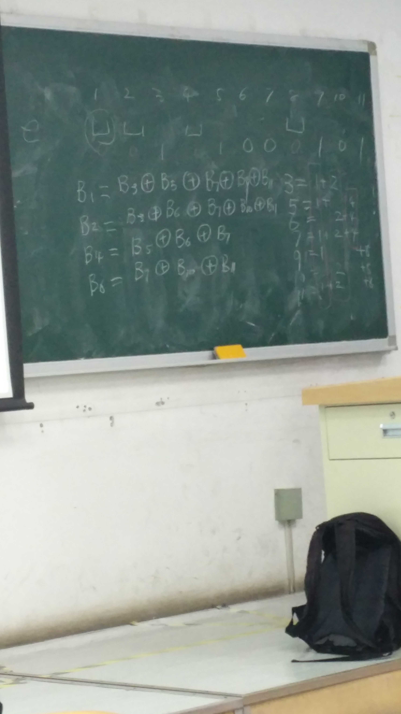

# Computer Network

## 第一章

1. 计算机网络协议:

    为计算机网络中进行数据交换而建立的规则,标准或约定的集合

2. 协议实体:

    任何发送或接收消息的软件或硬件

3. 服务原语:

    一个服务由一组原语正式说明,用户进程通过这些原语来访问该服务

4. 协议数据单元(PDU)

    包含来自上层的信息和当前层的实体附加的信息.

    在OSI模型当中,传输系统在每一层都将建立PDU

5. 数据链路层:

    将一个原始的传输设施变成一条没有漏检传输错误的线路

6. 网络层:

    控制子网的运行.关键问题是如何将数据包从源端路由送达接收方

7. 以太网是有线局域网

8. PDU:Protocol Data Unit

9. DHCP:Dynamic Host Configuration Protocol

10. TCP报文中的SYN:在建立连接时使用,同来同步序号

11. Multiplexing:信道共享

## 第二章:物理层

1. 调制:为了传送信息而对周期性或断续变化的载波或信号的某种特征所做的变更

2. 复用:信道共享

    调制的方法:

    1. 基带传输:信号传输占有传输介质从零到最大值的频率

    2. 通带传输:信号占据了以载波信号频率为中心的一段频带

3. 数据链路层:

    - 纠错码:
    - 海明码:

    如果想要检测d个错误,则需要编码之间相距d+1个汉明距离.如果想要纠错则需要2d+1才可以纠错

    对于只可能有1位错误,m位的信息,r位的纠错码,n位的总共的情况:

    由于n位一共有2^n个表达,需要纠错,而且只会有一个错误,所以对于一个m位的信息,会有n个错误的表达,1个正确的表达,所以对于2^m个编码来说就有(n+1)2^m个表达,应该小于或者等于2^n个表达

    (n+1)2^m<=2^n

    m+r+1<=2^r:简化版,理解:r个校验位有2^r种表达,用来标识m+r种错误和1种正确

    具体步骤:
    1. 选取2的幂作为校验位;

    

