# DataStructure_807

## （一）绪论

### 数据结构的基本概念，数据的逻辑结构、存储结构；

#### 逻辑结构:
1. 线性结构
2. 非线性结构
    - 树
    - 图
    - 集合

#### 存储结构

1. 顺序存储
2. 链接存储
3. 索引存储
    - 在存储的同时,还建立附加的索引表
4. 散列存储

### 算法的定义和应具有的特性，算法设计的要求，算法的时间复杂度分析和算法的空间复杂度分析。
 
## （二）线性表
 
### 线性结构的特点、线性表的定义，线性表的基本操作；

[list定义](./List/List.h)

线性表的顺序存**储**结构是一种*随机存**取***的存储结构,线性表的链式存储结构是一种*顺序存**取***的存储结构.

### 线性表的顺序存储结构，对其进行检索、插入和删除等操作；
 
### 线性表的链式存储结构，单链表、双向链表和循环链表这三种链表形式的存储结构和特点以及基本操作。
 
## （三）栈和队列，递归算法
 
### 栈的定义、结构特点及其存储方式(顺序存储与链接存储)和基本操作的实现算法；
 
### 队列的结构、特点及其存储方式(顺序存储与链接存储)和基本操作的实现算法。
[循环队列实现](./List/CircularQueue.h)

```c
// 初始化
Q.rear=Q.front=0;

// 判断空
Q.rear==Q.front;

// 判断队满
(Q.rear+1)%MAXSIZE==Q.front;

// 队列长度
(Q.rear+MAXSIZE-Q.front)%MAXSIZE;
```
 
### 递归的基本概念和实现原理以及用递归的思想描述问题和书写算法的方法；
 
### 用栈实现递归问题的非递归解法。
 
## （四）数组和串
 
### 串的基本概念、串的存储结构和相关的操作算法；
 
### 数组的存储结构，在顺序存储的情况下，数组元素与存储单元的对应关系；
 
### 稀疏矩阵的存储结构和特点以及基本操作。
    对于矩阵中实际存储的元素<<矩阵大小时,可以只存取三元组(行标,列标,值)的list.
 
### 字符串匹配算法(例如KMP算法)。
 
## （五）树和森林
 
### 树的结构和主要概念，各种二叉树的结构及其特点；

#### 树的基本术语

1. 度  

    树中一个节点的子节点个数称为该**节点的度**,树中最大度数称为**树的度**

2. 深度 

    从根节点开始自顶向下逐层累加

3. 高度 
   
    从叶节点开始自底向上逐层累加

4. 树的高度(深度) 

    树中节点最大的层数

#### 二叉树的特点

N<sub>0</sub>表示叶子节点数,N<sub>2</sub>表示度为2的节点则N<sub>0</sub>=N<sub>2</sub>+1

故在有N个节点的二叉树中,有N+1个空指针;空指针数 = 2*N<sub>0</sub>+N<sub>1</sub>=N<sub>0</sub>+N<sub>1</sub>+N<sub>2</sub>+1

#### 二叉树的数组表示方法

If a complete binary tree with n nodes is represented sequentially, then for any node with index i, $1 \leq i \leq n$, we have

1. parent(i) is at int(i/2) if $i \neq 1$. If i = 1, i is at the root and has no parent.
2. LeftChild(i) is at 2i if $2i \leq n$. If $2i \geq n$, then i has no left child.
3. RightChild(i) is at 2i+1 if $2i+1 \leq n$. If $2i+1 \geq n$, then i has no right child.


##### 二叉树与度为2的树的区别

1. 度为2的树至少含有三个节点才可以,二叉树则可为空
2. 度为2的树如果某个节点只有一个孩子节点则无需分左右,而二叉树不同 

#### 各种二叉树

1. 满二叉树
    
    叶子节点都在二叉树的最下一层,并且除叶节点之外的每个节点的度数都为2

2. 完全二叉树 

    每个节点都与高度一样的满二叉树编号一一对应.也就是只有最下一层的右边可以缺少元素.

3. 平衡二叉树

    树上任意节点的左子树和右子树的深度之差不超过1
 
### 二叉树的三种遍历方法的实现原理和性质，能将二叉树的遍历方法应用于求解二叉树的叶子结点个数、二叉树计数等问题，遍历的非递归实现方法；

#### 遍历方法

1. 先序遍历(PreOrder)

    顺序:根节点,先序遍历左子树,先序遍历右子树

    实现: [递归实现](./Tree/TreeNode.h#L51)

    非递归实现

    ```c
    void PreOrder2(BiTree t){
        InitStack(S);
        BiTree p = t;
        while(p||!IsEmpty(S)){
            if(p){
                visit(p);
                Push(S,p);
                p = p->lchild;
            }
            else{
                Pop(S,p);
                p=p->rchild;
            }
        }
    }
    ```

2. 中序遍历(InOrder)

    顺序:中序遍历左子树,根节点,中序遍历右子树

    实现: [递归实现](./Tree/TreeNode.h#L41)

    非递归实现

    ```c
    void InOrder2(BiTree t){
        InitStack(S);
        BiTree p = t;
        while(p||!IsEmpty(S)){
            if(p){
                Push(S,p);
                p = p->lchild;
            }
            else{
                Pop(S,p);
                visit(p);
                p=p->rchild;
            }
        }
    }
    ```

3. 后序遍历(PostOrder)

    顺序:后序遍历左子树,后序遍历右子树,根节点
    
    实现: [递归实现](./Tree/TreeNode.h#L62)

    非递归实现:

    ```c
    void PostOrder(BiTree T){
        InitStack(S);
        BiTree p = T;
        BiTree r = NULL:
        while(p||!IsEmpty(S)){
            if(p){
                push(S,p);
                p = p->lchild;
            }
            else{
                GetTop(S,p);
                if(p->rchild&&p->rchild!=r){
                    p=p->rchild;
                    push(S,p);
                    p=p->lchild;
                }
                else{
                    pop(S,p);
                    visit(p->data);
                    r=p;
                    p=NULL;
                }
            }
        }
    }
    ````


根据先序遍历和中序遍历或后序遍历和中序遍历可以确定一颗二叉树,而**先序和后序则不能确定一颗二叉树**

#### 层次遍历

```c
void LevelOrder(BiTree T){
    InitQueue(Q);
    BiTree p;
    EnQueue(Q,T);
    while (!IsEmpty(Q)){
        Dequeue(Q,p);
        visit(p);
        if(p->lchild!=NULL){
            EnQueue(Q,p->lchild);
        }
        if(p->rchild!=NULL){
            EnQueue(Q,p->rchild);
        }
    }
}
```

#### 计算树的深度

```c
int BitDepth(BiTree T){
    if (T==NULL) 
        return 0;
    else{
        ldep = Btdepth(T->lchild);
        rdep = Btdepth(T->rchild);
        if(ldep>rdep)
            return ldep+1;
        else
            return rdep+1;
    }

}
```
 
### 线索化二叉树的结构和基本操作；

格式:

| ltag| lchild|data|rchild|rtag|
|:----:|:----:|:----:|:----:|:----:|
| 1:指向节点的前驱| | | | 1:指向节点的后继|

中序线索二叉树示例

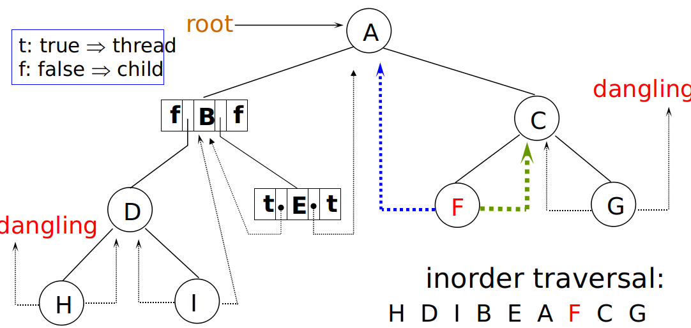
 
### 森林的定义和存储结构，森林的遍历等方法的实现；

#### 森林存储结构

1. 双亲表示法

    

2. 孩子表示法

    

3. 孩子兄弟表示法

    

#### 森林=>二叉树

用孩子兄弟表示法将树=>二叉树(由于根节点没有兄弟所以没有右子树)=>将森林的多颗树连在一起

例:


#### 森林遍历方法

树和森林遍历与二叉树遍历的对应关系

|树|森林|二叉树(将森林或树转换成的二叉树)|
|:----:|:---:|:----:|
|先根遍历|先序遍历|先序遍历|
|后根遍历|中序遍历|中序遍历|

### 基于霍夫曼树生成霍夫曼编码的方法；


### AVL树的定义和特点以及AVL树调整操作的实现原理；

#### AVL树的定义

节点的平衡因子是它的左子树的高度减去它的右子树的高度（有时相反）。带有平衡因子1、0或 -1的节点被认为是平衡的。

#### 调整操作

1. LR型

    

2. LL型

    

3. RR型

    

4. RL型

    

### 最优二叉树的构造原理和相关算法。

```c
treenode *huffmanTree(int n) {  //n为叶子个数
    int index = 0;        
    for (int i = 0; i < n; ++i) {  //将每一个叶子节点建成一棵树，放入数组tree[]中
        treenode *p = new treenode;
        p->data = arr[i];   //arr[]中放着叶子节点的权值
        p->lch = NULL;
        p->rch = NULL;
        tree[index++] = p;
    }
    treenode *root = NULL;   //定义最优二叉树的根
    for (int i = 0; i < n - 1; ++i) { //每次取arr[]中未使用的最小两个值
        sort(arr + i, arr + n);
        treenode *ch1 = NULL, *ch2 = NULL;
        for (int j = 0; j < index; ++j) {//在数组tree[]中找到这两个值，建立新的节点
            if(tree[j]->data == arr[i])
                ch1 = tree[j];
            if(tree[j]->data == arr[i + 1])
                ch2 = tree[j];
            if(ch1 && ch2) break;
        }
        treenode *p = new treenode;//建立新的节点，存入数组tree[]中
        p->data = ch1->data + ch2->data;
        p->lch = ch1;
        p->rch = ch2;
        root = p;//更新根，直到建立完成
        tree[index++] = p;
        arr[i + 1] = p->data;//并将这个节点的权值传入数组arr[]中
    }
    return root;
}
```

## （六）图

### 图的各种基本概念和各种存储方式；

#### 图的基本概念

1. 有向图

    

    表示法:

    V(G3)={0,1,2} 

    E(G3)={<0,1>,<1,0>,<1,2>}

    强连通: 节点v到w和w到v都有**路径**

    强连通分量: 极大强连通子图

    入度,出度: 入度和=出度和=边数

2. 无向图

    

    表示法

    V(G1)={0,1,2,3}

    E(G1)={(0,1),(0,2),(0,3),(1,2),(1,3),(2,3)}

    连通: 从v到w的**路径**存在,则v和w是连通的.

    连通图: 图G的任意两个顶点都是连通的.

    连通分量: 极大连通子图; 连通图只有一个连通分量; 非连通图有多个连通分量

    极大连通子图: 要求连通子图包含其所有的边

    极小连通子图: 保持连通又使得边数最少(生成树)

3. 完全图

    任意两个顶点都存在边.

    - n个顶点的有向图=>n(n-1)条边
    - n个顶点的无向图=>n(n-1)/2条边

4. 稀疏图|E|<|V|*log|V|和稠密图

#### 各种存储方式

1. 邻接矩阵法

    

2. 邻接表法

    

    定义:

    ```c
    ＃define   MaxVerNum  100          /*最大顶点数为100*/
    // 邻接表类型 ：
    typedef  struct  ArcNode
    { 
        int  adjvex;              /*邻接点域*/
        InfoType  *Info;     /*表示边上信息的域info*/
        struct ArcNode * next;    /*指向下一个邻接点的指针域*/
    } ArcNode ;    

    // 表头结点类型 ：
    typedef  struct  Vnode
    {
        VertexType   vertex;          /*顶点域*/
        ArcNode  * firstedge;        /*边表头指针*/
    } Vnode,  AdjList [MaxVertexNum];   

    // 图的类型 ： 
    typedef   struct
    {
        AdjList   vertices;         /*邻接表*/
        int   vexnum,  arcnum;          /*顶点数和边数*/
    } ALGraph;      /*ALGraph是以邻接表方式存储的图类型*/
    ```

### 图的两种搜索方法和图连的连通性；

#### 图的两种搜索方法


两个基本函数

```c
int FirstAdjVex(ALGraph G, int v)
{  
    // 返回G中第v个顶点的第1个邻接点的序号。如果v无邻接点，返回0。
    if(!G.vertices[v].firstarc) 
        return(0);
    else 
        return(G.vertices[v].firstarc->adjvex);
}

int NextAdjVex(ALGraph G, int v, int w)
{  
    // 返回G中第v个顶点的相对于顶点w的下一个邻接点的序号。
    // 如果v无相对于顶点w的下一个邻接点，返回0。
    ArcNode *p;
    p=G.vetrices[v].firstarc;
    while( p && p->adjvex!=w)
        p=p->nextarc;
    if(p->adjvex==w && p->nextarc)
        return(p->nextarc->adjvex);
    else 
        return(0);
}
```

1. DFS(深度优先)

    ```c
    void DFSTraverse( Graph G ) 
    {
        bool visited[MAX] ;  //用于标识结点是否已被访问过     
        for ( k=1; k<=G.vexnum; ++k ) 
            visited[k] = FALSE;
        for ( k=1; k<=G.vexnum; ++k )
            if ( !visited[ k ] )
                DFS(G, k);
    }

    void DFS( Graph G,  int v )
    {  
        visited[v] = TRUE;  
        VISIT( v );  // 访问图G中第v个顶点
        for (w=FirstAdjVex(G, v); w>0; w=NextAdjVex(G, v, w)) 
            if ( !visited[ w ] )
                DFS(G, w);
    }

    ```

2. BFS(广度优先)

    ```c
    void BFSTraverse( Graph G ) 
    { 
        bool visited[MAX] ;  //用于标识结点是否已被访问过     
        for (v=1; v<=G.vexnum; ++v)  
            visited[v] = FALSE;
        InitQueue(Q);
        for(v=1; v<=G.vexnum; ++v)
            if ( !visited[v] ) 
            {  
                visited[v]=TRUE;
                VISIT(v);
                EnQueue(Q, v);
                while (!EmptyQueue(Q))
                { 
                    DeQueue(Q,u); 
                    for(w=FirstAdjVex(G, u); w>0; w=NextAdjVex(G, u, w))
                        if( !visited[w] )  
                        {  
                            visited[w]=TRUE; 
                            VISIT(w); 
                            EnQueue(Q, w); 
                        }
                } // end while
            } // end if
    }
    ```

### 两种最小生成树的生成方法；

1. Prim 算法

    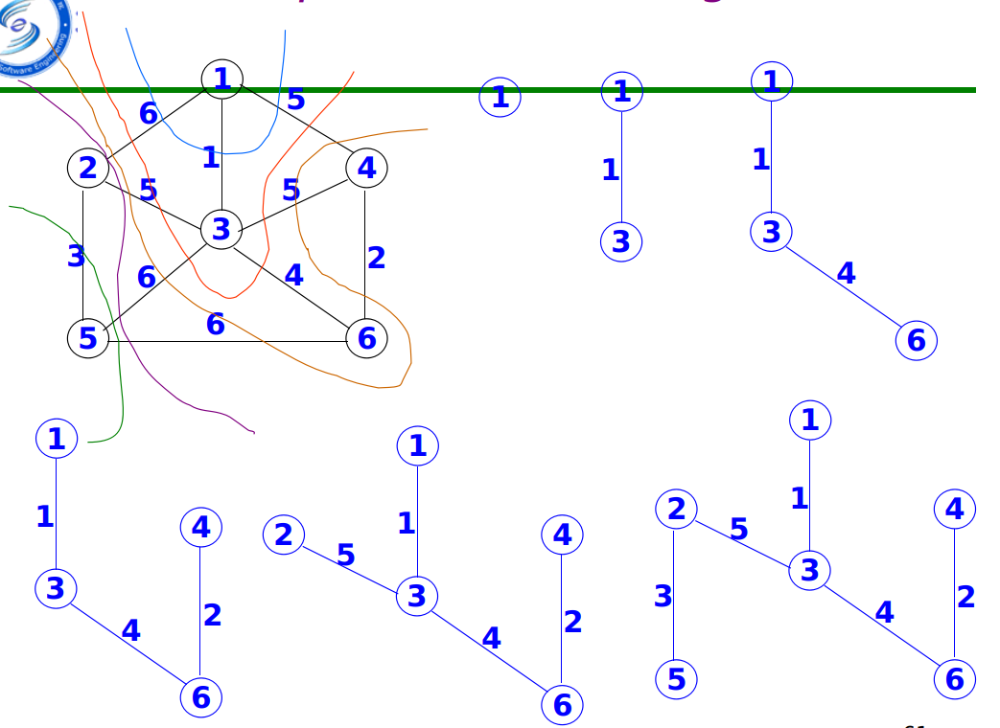

2. Kruskal 算法

    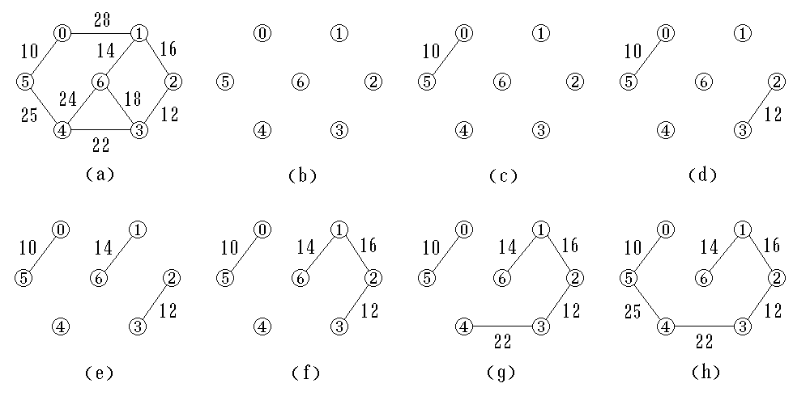

### 各种求最短路径的方法；

1. Dijkstra 算法

    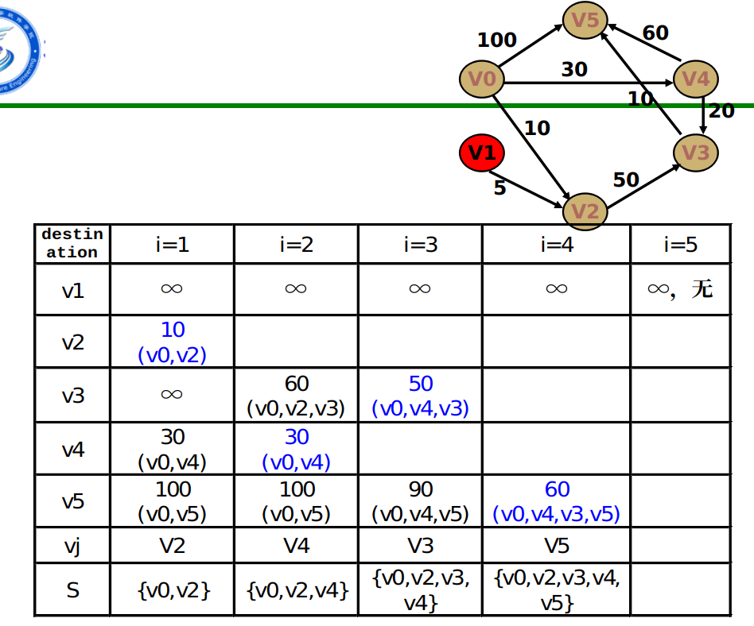

2. Floyed 算法

    

### 用顶点表示活动和用边表示活动的两种网络结构特点和相关操作的实现算法。

1. AOV-Network (Activity on Vertex)    

    顶点表示活动,边<v<sub>1</sub>,v<sub>2</sub>>表示活动v1先于活动v2,必须是有向无环图.(依赖关系)

    拓扑排序:

        1. 从图中选择一个没有前驱的节点并输出
        2. 从图中删除该节点和以它为起点的有向边
        3. 重复步骤1,2

    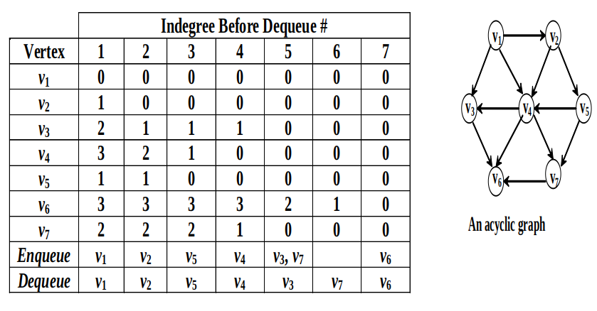

2. AOE-Network (Activity on Edge)

    顶点表示事件,有向边表示活动,边上的权重表示完成该活动的开销.(软件项目安排)

    关键路径: 从起点到终点的所有路径中,具有最大的路径长度的路径

        1. 求AOE中所有事件的最早发生时间ve():从前往后计算
        2. 求AOE中所有事件的最晚发生时间vl():从后往前计算
        3. 求AOE中所有活动的最早开始时间e():边的起点的顶点的最早发生时间
        4. 求AOE中所有活动的最晚开始时间l():边的终点的顶点的最晚发生时间-边的权重
        5. 求AOE中所有活动的差额d(),找出d()=0构成关键路径

    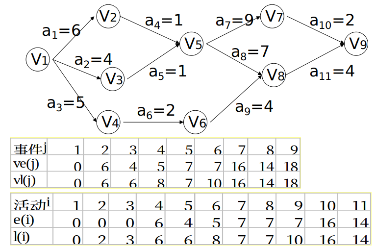

## （七）排序

### 插入排序法(含折半插入排序法)、选择排序法、冒泡排序法、快速排序法、堆积排序法、归并排序、基数排序等排序方法排序的原理、规律和特点；

1. 插入排序

    ```c
    // 直接插入排序
    void InsertSort(int a[], int length){
        /*
        * 插入排序
        * 从头开始保证走过的路有序,每加入一个元素就将其插入到正确的位置
        */
        int j,i;
        for(i=2;i<length;i++){
            if (a[i]<a[i-1]){
                a[0] = a[i];
                for(j=i-1;a[0]<a[j]; j--)
                    a[j+1] = a[j];
                a[j+1] = a[0];
            }
        }
    }

    // 折半插入排序
    void InsertSort(ElemType A[], int n){
        int i,j,low,high,mid;
        for(i=2;i<=n;i++){
            A[0]=A[i];
            low=1;
            high=i-1;
            while(low<=high){
                mid=(low+high)/2
                if(A[mid].key>A[0].key)
                    high = mid-1; // 查找左半子树
                else
                    low=mid+1 // 查找右半子树
            }
            for(j=i-1;j>=high+1;--j)
                A[j+1]=A[j];
            A[high+1]=A[0];
        }
    }

    // 希尔排序
    void ShellSort(SqList &L,int dlta[],int t)
    { 
        // 按增量序列dlta[0..t-1]对顺序表L作希尔排序。算法.5
        int k;
        for(k=0;k<t;++k){
            ShellInsert(L,dlta[k]); // 一趟增量为dlta[k]的插入排序
            printf("第%d趟排序结果: ",k+1);
            print(L);
        }
    }
    void ShellInsert(SqList &L,int dk){ 
        // 对顺序表L作一趟希尔插入排//序。本算法是和一趟直接插入排序相比，
        // 作了以下修改：
        // 1.前后记录位置的增量是dk，而不是1;
        // 2.r[0]只是暂存单元，不是哨兵。当j<=0时，插入位置已找到。
        int i,j;
        for(i=dk+1;i<=L.length;++i){
            if LT(L.r[i].key,L.r[i-dk].key){ 
                // 需将L.r[i]插入有序增量子表
                L.r[0]=L.r[i]; // 暂存在L.r[0]
                for(j=i-dk;j>0&&LT(L.r[0].key,L.r[j].key);j-=dk)
                    L.r[j+dk]=L.r[j]; // 记录后移，查找插入位置
                L.r[j+dk]=L.r[0]; // 插入
            }
        }
    }
    ```

2. 选择排序

    ```c
    void SelectSort(ElemType A[], int n){
        for (i=0;i<n-1;i++){
            int min = i;
            for(j=i+1; j<n; j++){
                if(A[j]<A[min])
                    min = j;
            }
            if (min!=i)
                swap(A[i], A[min]);
        }
    }
    ```

3. 冒泡排序

    ```c
    void bubble_sort(int a[],int n) { 
        // 将a中整数序列重新排列成自小至大有序的整数序列(起泡排序)
        int i,j,t;
        Status change = TRUE;
        for(i=n-1;i>1&&change;--i){
            change=FALSE;
            for(j=0;j<i;++j)
            if(a[j]>a[j+1]){
                t=a[j];
                a[j]=a[j+1];
                a[j+1]=t;
                change=TRUE;
            }
        }
    }
    ```

4. 快速排序

    ```c
    void QuickSort(int a[], int low, int high){
        if (low<high){
            int mid = partition(a, low,high);
            QuickSort(a, low, mid-1);
            QuickSort(a, mid+1, high);
        }
    }

    int partition(int a[],int low,int high){
        int pivot = a[low];
        while(low<high){
            while(a[high]>=pivot && low<high)
                high--;
            a[low] = a[high];
            while(a[low]<=pivot && low<high)
                low++;
            a[high] = a[low];
        }
        a[low] = pivot;
        return low;
    }
    ```

5. 堆排序

    算法步骤:
    1. 构造初始堆

        1. 假设给定无序序列结构如下

        

        2. 此时我们从最后一个非叶子结点开始（叶结点自然不用调整，第一个非叶子结点 arr.length/2-1=5/2-1=1，也就是下面的6结点），从左至右，从下至上进行调整。

        

        3. 找到第二个非叶节点4，由于[4,9,8]中9元素最大，4和9交换。

        

        4. 这时，交换导致了子根[4,5,6]结构混乱，继续调整，[4,5,6]中6最大，交换4和6

        

    2. 调整堆

        1. 将堆顶元素9和末尾元素4进行交换

        

        2. 重新调整结构，使其继续满足堆定义

        

        3. 再将堆顶元素8与末尾元素5进行交换，得到第二大元素8.

        

        4. 后续过程，继续进行调整，交换，如此反复进行，最终使得整个序列有序

        

    > https://www.cnblogs.com/chengxiao/p/6129630.html

    ```c
    void AdjustDown(int a[], int k, int len){
        a[0] = a[k];
        for (int i=k*2; i<=len; i*=2){
            if(i<len&&a[i]<a[i+1])
                i++;
            if(a[0]>=a[i])
                break;
            else{
                a[k] = a[i];
                k=i;
            }
        }
        a[k] = a[0];
    }

    void HeapSort(int a[], int length){
        // build max heap
        for (int i=length/2; i>0; i--)
            AdjustDown(a, i, length);

        for (int i=length;i>1; i--){
            int t=a[1];
            a[1] = a[i];
            a[i] = t;

            AdjustDown(a,1, i-1);
        }
    }
    ```

6. 归并排序

    ```c
    void merge(int a[], int low, int mid, int high, int b[]){
        for(int i=low; i<=high; i++)
            b[i] = a[i];
        int l,h,k;
        for (k=low,l=low,h=mid+1; l<=mid&&h<=high;k++){
            if(b[l]<=b[h])
                a[k] = b[l++];
            else
                a[k] = b[h++];
        }
        while(l<=mid)
            a[k++]=b[l++];
        while(h<=high)
            a[k++]=b[h++];
    }

    void MergeSort(int a[], int low, int high, int b[]){
        if (low<high){
            int mid = (low+high)/2;
            MergeSort(a, low, mid,b);
            MergeSort(a,mid+1, high, b);
            merge(a, low, mid , high, b);
        }
    }

    void MergeSort(int a[], int len){
        int *b = new int[len];
        MergeSort(a, 1, len, b);
        delete []b;
    }
    ```

7. 基数排序

    将所有待比较数值（正整数）统一为同样的数字长度，数字较短的数前面补零。然后，从最低位开始，依次进行一次排序。这样从最低位排序一直到最高位排序完成以后，数列就变成一个有序序列。

    时间复杂度:O(d(n+r))

    其中d:d趟分配与收集;一趟分配:O(n);一趟收集:O(r)

### 各种排序算法的时空复杂度的简单分析。

|排序名称|类别|稳定性|时间复杂度|空间复杂度|最少比较次数|最多比较次数|最少移动次数|最多移动次数|
|:-----:|:-----:|:-----:|:-----:|:-----:|:----:|:----:|:----:|:----:|
|插入排序|插入排序|稳定|O(n<sup>2</sup>)|O(1)|n-1|(n+2)(n-1)/2|0|(n+4)(n-1)/2|
|希尔排序|插入排序|不稳定|O(n<sup>1.5</sup>)|o(1)|/|/|/|/
|冒泡排序|交换排序|稳定|O(n<sup>2</sup>)|o(1)|n-1|n(n-1)/2|0|n(n-1)/2|
|快速排序|交换排序|不稳定|O(n*log<sub>2</sub>n)|o(1)|O(n*log<sub>2</sub>n)|n(n-1)/2|O(n*log<sub>2</sub>n)|/|/|
|选择排序|选择排序|**不稳定**|O(n<sup>2</sup>)|O(1)|n-1|n(n-1)/2|0|3(n-1)|
|堆排序|选择排序|不稳定|O(n*log<sub>2</sub>n)|O(1)|O(n*log<sub>2</sub>n)|O(n*log<sub>2</sub>n)|/|/|
|归并排序|归并排序|稳定|O(n*log<sub>2</sub>n)|O(n)|O(n*log<sub>2</sub>n)|O(n*log<sub>2</sub>n)|/|/|
|基数排序|基数排序|稳定|O(d(n+rd))|O(rd)|0|0|0|0|


|排序名称|平均情况|最好情况|最坏情况|
|:-----:|:-----:|:-----:|:-----:|
|直接插入排序|O(n<sup>2</sup>)|O(n)|o(n<sup>2</sup>)|
|希尔排序|O(n<sup>1.5</sup>)||
|冒泡排序|O(n<sup>2</sup>)|O(n)|O(n<sup>2</sup>)|
|快速排序|O(n*log<sub>2</sub>n)|O(n*log<sub>2</sub>n)|O(n<sup>2</sup>)
|简单选择排序|O(n<sup>2</sup>)|O(n<sup>2</sup>)|O(n<sup>2</sup>)|
|堆排序|O(n*log<sub>2</sub>n)|O(n*log<sub>2</sub>n)|O(n*log<sub>2</sub>n)|
|归并排序|O(n*log<sub>2</sub>n)|O(n*log<sub>2</sub>n)|O(n*log<sub>2</sub>n)|
|基数排序|O(d(n+rd))|O(d(n+rd))|O(d(n+rd))|

## （八）索引结构与散列

### 线性索引结构、倒排表、静态搜索树的结构和特点；

1. 线性索引结构

    1. 稠密索引

        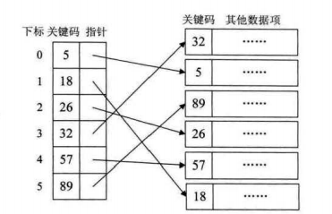

    2. 分块索引

        

    3. 倒排索引 

        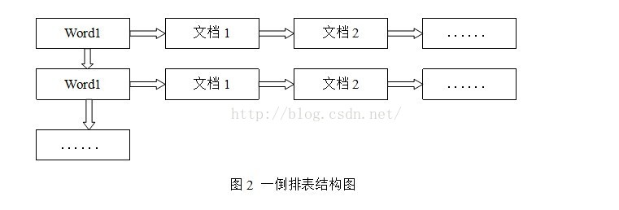

    4. 正排索引

        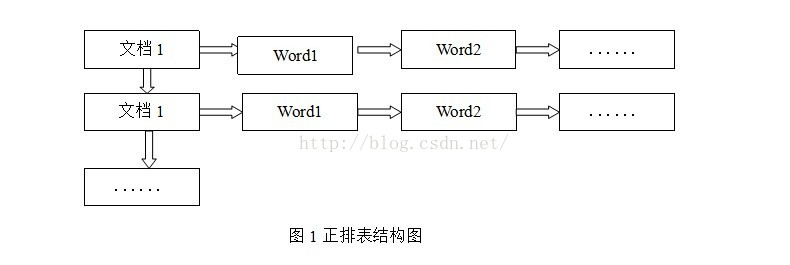
    
2. 静态搜索树


    查找表中各关键字被查找的概率是不同的

    含有 9 个关键字的查找表及其相应权值如下表所示：

    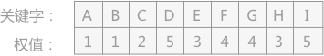

    1. 求出查找表中所有的 △P 的值，找出整棵查找表的根结点：
    
        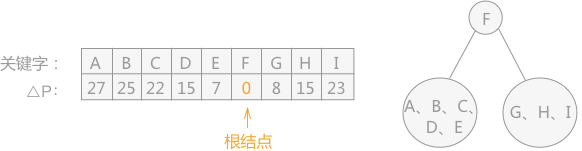

        例如，关键字 F 的 △P 的计算方式为：从 G 到 I 的权值和 - 从 A 到 E 的权值和 = 4+3+5-1-1-2-5-3 = 0。 
    
    2. 通过上图左侧表格得知，根结点为 F，以 F 为分界线，左侧子表为 F 结点的左子树，右侧子表为 F 结点的右子树（如上图右侧所示），继续查找左右子树的根结点:

        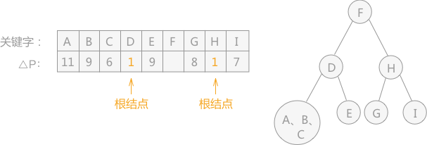

    3. 通过重新分别计算左右两查找子表的 △P 的值，得知左子树的根结点为 D，右子树的根结点为 H （如上图右侧所示），以两结点为分界线，继续判断两根结点的左右子树:

        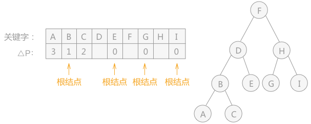
    
    注意：在建立次优查找树的过程中，由于只根据的各关键字的 P 的值进行构建，没有考虑单个关键字的相应权值的大小，有时会出现根结点的权值比孩子结点的权值还小，此时就需要适当调整两者的位置。

    > http://www.cnblogs.com/ciyeer/p/9067098.html

### B树的结构

m阶: 1<子节点数量<=M ,M>=2,空树除外（注：m阶代表一个树节点最多有多少个查找路径，m阶=m路,当m=2则是2叉树,m=3则是3叉）；

1. 插入 (m=5, 每个节点含有[2,4]个value)

    

    插入6

    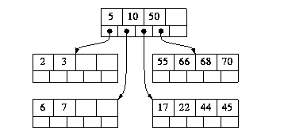

2. 删除

    1. case 1
        
        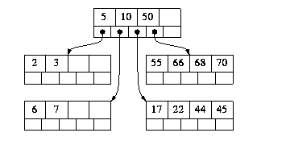

        删除6

        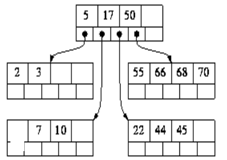

    2. case 2

        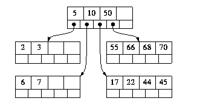

        删除3

        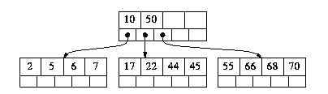

### 散列的实现原理和各种操作的实现算法。

1. Hash 函数

    1. 直接地址法

        H(key)=a*key+b 

        适合于关键字分布基本连续

    2. 除留余数法

        H(key)=key%p

        假定散列表长为m,取一个不大于m但接近或等于m的质数P

    3. 数字分析法

        适用于已知关键字数字集合

    4. 平方取中法

        取关键字的平方值的中间几位作为散列地址

    5. 折叠法

        将关键字分割成位数相同的几部分,然后取这几部分的叠加和作为散列地址

2. 冲突处理

    1. 开放地址法

        递推式: H<sub>i</sub>=(H(key) + d<sub>i</sub>) % m

        d<sub>i</sub>是增量

        删除时不能随便物理删除表中已有的元素,若删除将会截断其他具有相同的散列地址的元素的查找地址,所以要进行逻辑删除,打一个标记,定期维护,将删除标记的元素物理删除.

        1. 线性探索法

            往下一个一个找

        2. 平方探索法

            当d<sub>i</sub> = 1^2,-1^2,2^2,-2^2,...,k^2,-k^2,其中$k \leq m/2$, m必须为可以表示成4k+3的质数

            可以避免出现堆积的问题,但是不能探测到所有单元

        3. 再散列法

            d<sub>i</sub>=Hash<sub>2</sub>(key)

        4. 伪随机法

            d<sub>i</sub>=伪随机序列

    2. 拉链法

        往后拉链表

3. 装填因子
   
   a = 表中记录数n/散列表长度m