# Operating System

## （一）基本概念

### 计算机基本构成、处理器的内部结构、高速缓冲存储器CACHE；

#### 计算机的基本构成

存储器、控制器、运算器、输入设备、输出设备

#### 处理器的内部结构

CPU主要有运算器、控制器、寄存器组合内部总线等部件组成。

#### cache

当处理器发出内存访问请求时，会先查看缓存内是否有请求数据。如果存在（命中），则不经访问内存直接返回该数据；如果不存在（失效），则要先把内存中的相应数据载入缓存，再将其返回处理器。

### 操作系统的概念、演变历程、特性、分类、运行环境、功能；

#### 操作系统的概念

操作系统是一种系统软件

#### 演变历程

1. 手工操作阶段

    无操作系统

2. 批处理阶段

    1. 单道批处理系统
        
        内存中始终保持一道作业

    2. 多道批处理系统

        允许多个程序同时计入内存并运行,当某个程序因I/O请求而暂停运行时,CPU转去运行另一道程序

3. 分时操作系统

    时间片

4. 实时操作系统

    为了再某个时间限制内完成某些紧急任务而不需时间片排队, 主要特点是及时性和可靠性.

    1. 硬实时系统

        必须绝对地再规定的时刻发生, 如导弹发射系统

    2. 软实时系统

        允许偶尔违反时间规定, 如飞机订票系统.

#### 特征

1. 并发

    宏观上多个程序在运行,通过分时得以实现

2. 共享

    系统中的资源可供内存中多个并发执行的进程共同使用

3. 虚拟
4. 异步

    可能导致进程产生与时间有关的错误

#### 运行环境

#### 功能

1. 时钟管理

    计时,通过时钟中断实现进程切换.

2. 中断机制

    - 外中断: 如设备发出I/O结束中断;时钟中断
    - 内中断(异常): 如程序的非法操作码,地址越界...

3. 原语

    程序的运行需要原子性,如CPU切换,进程通信等功能中的部分操作.

4. 系统控制的数据结构及处理

    1. 进程管理
    2. 存储器管理
    3. 设备管理

### 存储器的层次结构。


## （二）进程

### 进程的概念和特点；

#### 概念

为了是参与并发执行的程序能独立的运行，必须为之配置一个专门的数据结构，称之为进程控制块（process control block），系统利用PCB来描述进程的基本情况和运行状态，进而控制和管理进程。

组成:

1. PCB: 保存进程运行期间相关数据,是进程存在的唯一标识

    

2. 程序段: 能被进程调度程序调度到CPU运行的程序的代码段
3. 数据段: 存储程序运行期间的相关数据 

#### 特点

1. 动态性：进程是程序的一次执行，他有着创建、活动、暂停、终止等过程，具有一定的生命周期，是动态的产生、变化和消亡的。动态性是进程最基本的特征。

2. 并发性：至多个进程实体，同存于内存中，能在一段时间内同时运行，并发性是进程的重要特征，同时也是操作系统的重要特征，引入进程的目的就是为了是程序能与去其他进程的程序并发执行，以提高资源利用率。

3. 独立性：指进程实体是一个能独立运行、独立获得资源和独立接收调度的基本单位。范围建立PCB的程序都不能作为一个独立的单位参与运行。

4. 异步性：由于进程的相互制约，是进程具有执行的间断性。也即进程按各自独立的、不可预知的速度向前推进。异步性会导致执行结果不可再现性，为此，在操作系统中必须配置相应的进程同步机制。 

5. 结构性：每个进程都配置一个PCB对其进行描述。从结构上来看，进程实体是由程序段、数据段和进程控制端三部分组成的。

### 进程状态转换

进程状态

1. 运行状态：进程正在处理器上运行。在单处理器的环境下，每一时刻最多只有一个进程处于运行状态。
2. 就绪状态：进程已处于准备运行的状态，即进程获得了除CPU之外的一切所需资源，一旦得到处理器即可运行。
3. 阻塞状态：又称为等待状态：进程正在等待某一事件而暂停运行，如等待某资源为可用（不包括处理器），或等待输入输出的完成。及时处理器空闲，该进程也不能运行。
4. 创建状态：进程正在被创建，尚未转到就绪状态。创建进程通常需要多个步骤：首先申请一个空白的PCB，并向PCB中填写一些控制和管理进程的信息；然后由系统为该进程分配运行时所必须的资源；最后把该进程转入到就绪状态。
5. 结束状态：进程正在从系统中消失，这可能是进程正常结束或其他原因中断退出运行。当进程需要结束运行时，系统首先必须置该进程为结束状态，然后再进一步处理资源释放和回收工作。

    注意区别就绪状态和等待状态：就绪状态是指进程仅缺少处理器，只要活得处理器资源就立即执行；而等待状态是指进程需要其他资源或等待某一事件，即使处理器空闲也不能运行。

状态转换

- 就绪状态=>运行状态: 通过处理器调度,就绪进程得到处理器资源
- 运行状态=>就绪状态: 时间片用完或有更高优先级的进程进入
- 运行状态=>阻塞状态: 进程所需要的某一资源还未准备好
- 阻塞状态=>就绪状态: 进程需要的资源已经准备好

## （三）线程、对称多处理SMP和微内核

### 线程的概念，定义线程的必要性和可能性；

#### 概念

程序执行流的最小单元,由线程ID,程序计数器,寄存器集合和堆栈组成.

#### 必要性

进程的切换开销很大,而线程的开销较小.而且线程间通讯效率更高.使系统拥有更好的并发性,提高了系统的吞吐性.

#### 可能性

当然可能,废话

### 线程的功能特性与实现方式；

#### 功能特性

线程状态

1. 阻塞: 当线程需要等待一个事件,它将被阻塞(保存它的用户寄存器,程序计数器,栈指针),此时处理器执行同一进程中或不同进程的就绪线程

    注:程序计数器是用于存放下一条指令所在单元的地址的地方。

2. 解除阻塞
3. 结束

#### 实现方式

用户级线程&内核级线程


用户级线程(多对一)

- 优点: 效率比较高
- 缺点: 当一个线程在使用内核服务时被阻塞了,那么整个进程都会被阻塞
  
内核级线程(一对一)

- 优点: 当一个线程在被阻塞时,完全不慌
- 缺点: 效率低

多对多模型: 将n个用户级线程映射到m个内核级线程上,要求m小于等于n

- 缺点&优点: 集大成者

### 线程vs进程

1. 调度

    线程时**独立调度**的基本单位,进程时**拥有资源**的基本单位

2. 拥有资源

    进程拥有系统资源,线程也有一点必不可少的资源.

3. 并发性

    拥有线程的操作系统并发性更好.

4. 系统开销

    进程的创建,切换,撤销的效率低于线程

5. 地址空间和其他资源

    进程之间的地址空间相互独立

6. 通信资源

    进程间的通信(IPC)需要进行进程同步和互斥手段的辅助

### 对称多处理SMP体系结构；

#### SMP (Symmetric multiprocessing)

SMP是一种紧耦合、共享存储的系统模型，特点是多个CPU使用共同的系统总线，因此可访问共同的外设和存储器资源。（所有处理器通过一条高速总线或者一个转换器在同一机器中紧密耦合。处理器共享同样的全局内存、磁盘和 I/0 设备。只有一份操作系统的副本跨所有处理器运行，并且操作系统必须设计为能利用这种体系结构（多线程操作系统））


#### 对称多处理系统

即每个处理器自我调度.在对称多处理系统上，在操作系统的支持下，无论进程是处于用户空间，或是核心空间，都可以分配到任何一个处理器上运行。因此，进程可以在不同的处理器间移动，达到负载平衡，使系统的效率提升。

#### 非对称处理系统

让一个处理器(主服务器)处理所有的调度,决定,I/O处理以及其他系统活动,其他的处理器只执行用户代码。这种非对称处理系统

#### SMP体系结构


1. 并发进程或线程：为了允许多个处理器同时执行相同的内核代码，内核例程必须是可重入的。多处理器执行内核的相同部分和不同部分时，必须正确的管理内核表和管理结构，以避免死锁或非法操作；

2. 调度：调度可以由任何处理器执行，因此必须避免冲突。如果使用内核级多线程，则可能出现同一时刻，多个处理器同时从同一个进程中调度多个线程的情况；

3. 同步：因此存在多个进程都可能访问共享地址空间和共享I/O资源的情况，因此需要提供同步机制。同步是指实施互斥和事件排序的机制。锁是一个通用的同步机制；

4. 存储器管理：多处理器系统为了提高性能，尽可能利用硬件的并行性，如多端口存储器，还必须协调不同处理器上的分页机制，以确保多个处理器共享页或段时页面的一致性问题，以及页替换策略；

5. 可靠性和容错：当一个处理器处理失败时，操作系统应该提供功能衰减能力，重新组织管理表；

### 操作系统的体系结构（微内核与单内核）及其性能分析。

#### 单内核

单内核就是把os从整体上作为一个单独的大过程来实现，同时也运行在一个单独的地址空间上。性能好,Unix系统就是单内核.Linux也是单内核,但它加入了很多高级的东西

#### 微内核

微内核的功能被划分为多个独立的过程，每个过程叫做一个服务器。各个服务器通信需要IPC机制,模块化安全且省地方.windows等

## （四）并发

### 并发性问题及相关概念，如临界区、互斥、信号量和管程等；

#### 临界区

每个**进程**有一个代码段称为临界区,在该区的进程可能会改变共同的变量等.重要的特征:当一个进程进入到临界区,其他进程不可以进来.


1. 抢占内核

   允许处于内核模式的进程被抢占

2. 非抢占内核
    
   允许处于内核模式的进程被抢占

#### 互斥(间接制约关系)

是指某一资源同时只允许一个访问者对其进行访问，具有唯一性和排它性。但互斥无法限制访问者对资源的访问顺序，即访问是无序的。

#### 同步(直接制约关系)

是指在互斥的基础上（大多数情况），通过其它机制实现访问者对资源的有序访问。在大多数情况下，同步已经实现了互斥，特别是所有写入资源的情况必定是互斥的。少数情况是指可以允许多个访问者同时访问资源。

#### 信号量

信号量S是整数变量,除了初始化,它的值表示**还可以有几个线程进入临界区**,只能通过两个原子操作访问:

wait(S)=>P操作

```c
wait(S){
    while(S<=0)
        ;
    S--;
}
```

signal(S)=>V操作

```c
signal(S){
    S++;
}
```

二进制的信号量又称为**同步锁**

上述的信号量的缺点时**忙等待**,这类型的信号量称为自旋锁(spinlock)

在多处理器的情况下,必须禁止每个处理器的中断.

为了克服忙等待,当一个进程调用wait操作时,发现信号量小于0时,则将自己放入等待队列并阻塞自己,当调用signal时,通过wakeup操作,将等待队列中的某进程从等待状态=>就绪状态,等系统调度执行. 定义如下:

```c
typedef struct{
    int value;
    struct process *list; //PCB链表
}semaphore;

wait(semaphore *S){
    S->value--;
    if (S->value<0){
        // add this process to list
        block();
    }
}

signal(S){
    S->value++;
    if (S->value <=0 ){
        remove a process P from list
        wakeup(P);
    }
}
```

#### 管程 = 互斥锁 + 条件变量

管程可以看做一个软件模块，它是将共享的变量和对于这些共享变量的操作封装起来，形成一个具有一定接口的功能模块，进程可以调用管程来实现进程级别的并发控制。

管程只允许一个进程执行管程中的代码,但是进入管程的线程可以因为条件未满足,放弃继续执行,并被放入条件队列中,等时机成熟再执行

哲学家吃饭例子:哲学家围成一个圈,当哲学家饿了,并且两边的人没有正在吃饭,则可拿起两根筷子吃饭

```c
monitor dp
{
   enum {thinking, hungry, eating} state[5];
   condition self[5];

   void pickup(int i) {
      state[i] = hungry;
      test(i);
      if (state[i] != eating)
         self[i].wait();//P操作
   }

   void putdown(int i) {
      state[i] = thinking;
      test( (i+4)%5 ); // important
      test( (i+1)%5 ); // important
   }

   void test(int i) {
      if ((state[(i+4)%5] != eating) &&
          (state[i] == hungry) &&
          (state[(i+1)%5] != eating)) {
         state[i] = eating;
         self[i].signal();//V操作
      }
   }

   void init() {
      for (int i = 0; i < 5; i++)
         state[i] = thinking;
   }
}
```

### 进程互斥、同步和通信的各种算法；

1. 生产者-消费者问题

    ```c
    semaphore mutex = 1;
    semaphore empty = n;
    semaphore full = 0;

    producer(){
        while(true){
            produce an item in nextp;
            wait(empty) // P操作,empty--

            wait(mutex);
            add nextp to buffer;
            signal(mutex);

            signal(full); // V操作,full++
        }
    }

    consumer(){
        while(true){
            wait(full);

            wait(mutex);
            remove an item from buffer;
            signal(mutex);

            signal(empty);
            consumer the item;
        }
    }
    ```

2. 读者-写者问题: 允许多个读者读,但只允许一个写者写

    - 读者优先
     
        ```c个
        int count=0;
        semaphore mutex=1; //保护count
        semaphore rw=1; //保证读者和写者互斥地访问文件

        writer(){
            while(true){
                wait(rw);
                writing;
                singal(rw);
            }
        }

        reader(){
            while(true){
                wait(mutex);
                if(cout==0)
                    wait(rw);
                cout++;
                singal(mutex);

                reading;

                wait(mutex);
                count--;
                if(count==0)
                    singal(rw);
                singal(mutex);
            }
        }
        ```

    - 写者优先(公平算法)

        ```c
        int count=0;
        semaphore mutex=1;
        semaphore rw=1;
        semaphore w=1;

        writer(){
            while(true){
                wait(w);
                wait(rw);
                writing;
                singal(rw);
                singal(w);
            }
        }

        reader(){
            while(true){
                wait(w); //无写进程时请求进入
                wait(mutex);
                if (count==0)
                    wait(rw);
                count++;
                singal(mutex);
                singal(w);

                reading;

                wait(mutex);
                count--;
                if (count==0)
                    singal(rw);
                singal(mutex);
            }
        }
        ```

### 死锁的概念、死锁的原因和条件；

#### 概念

互相等待

#### 死锁的必要条件

产生死锁必须同时满足一下四个条件

1. 互斥条件
    
    至少有一个资源处于非共享模式,即一次只能有一个进程使用

2. 非抢占(不可剥夺条件)

    资源不能被抢占,即资源只有在进程完成时后才释放.

3. 占有并等待(请求和保持条件)

    一个进程必须占有至少一个资源,并等待另一个资源,而该资源为其他进程所占有

4. 循环等待条件

    有一组等待进程{p0,p2,...,pn},p0等待的资源被p1占有,p1等待的资源被p2占有,...,pn的资源被p0占有


#### 资源分配图

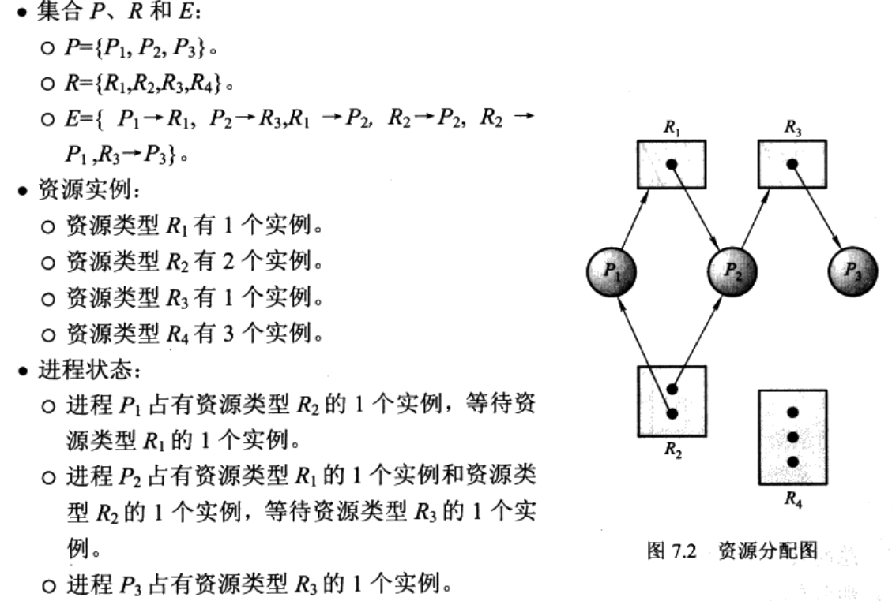

如果分配图有环,则**可能**存在死锁

如果每个资源类型刚好有一个实例,那么有环一定死锁

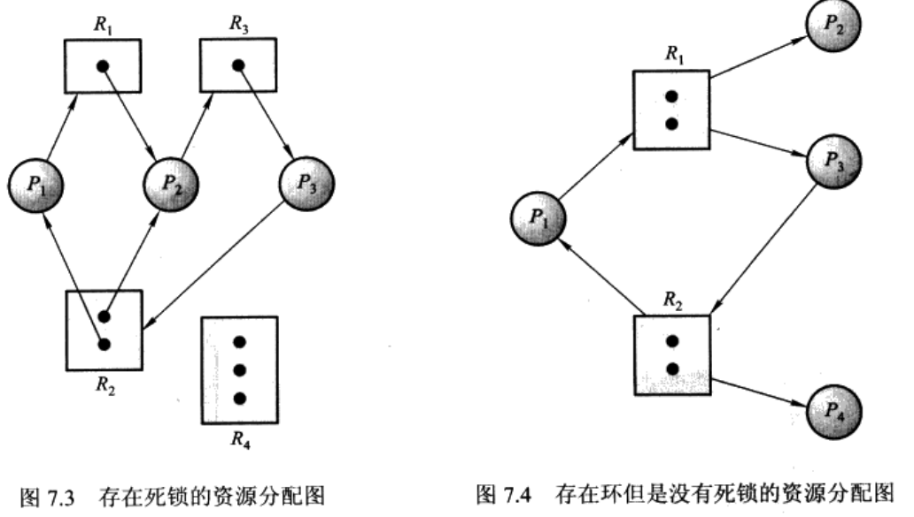

### 死锁的预防、避免和检测算法。

||资源分配策略|各种可能模式|主要优点|主要缺点|
|:----:|:----:|:----:|:----:|:----:|
|死锁预防|保守,宁可资源闲置|一次请求所有资源,资源剥夺,资源按序分配|适用与做突发式处理的进程,不必进行剥夺|效率低;剥夺次数多;不便灵活申请新资源|
|死锁避免|折中(在运行时判断是否可能死锁)|寻找可能的安全允许顺序|不必进行剥夺|必须知道将来的资源需求;进程不能被长时间阻塞|
死锁检测|宽松,只要允许就分配资源|定期检查死锁是否已经发生|不延长进程初始化事件,允许堆死锁进行现场处理|通过剥夺解除死锁,造成损失|

#### 死锁的预防

破坏死锁的四个必要条件之一

1. 破坏互斥条件

    如果允许所有资源都可以共享使用即可.

2. 破坏非抢占

    当某个进程已经拥有某互斥资源,再去请求新资源不被满总时,应释放已拥有的资源.

    缺点: 释放已获得的资源可能导致前一段的工作失效,反复的申请和释放资源会增加系统开销,降低系统吞吐量,所以这种方法适用于易于保存和恢复的资源.
       
3. 破坏占有并等待

    采用预先静态分配方式,即进程再运行前,一次申请完它所需要的全部资源.

    缺点: 系统资源被严重浪费,而且还会导致饥饿.

4. 破坏循环等待

    采用顺序资源分配法,首先给系统的资源编号,规定每个进程必须按照编号递增的顺序请求资源.

    缺点: 编号必须相对稳定,限制了新类型设备的增加.会发生作业使用资源的顺序于系统规定顺序不同的情况;给用户变成带来麻烦.

#### 死锁的避免

在资源动态分配过程中防止系统进入不安全的状态.

1. 系统安全状态

    对于进程顺序<p1,p2..pn>, pi还需要的资源数 < 系统还剩资源数+所有在他前边的p所拥有的资源数,有次序列系统就处于安全状态. 

    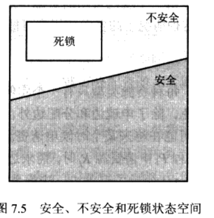

    假设系统中有三个进程P1、P2和P3,共有12 台磁带机。进程P1总共需要10台磁带机，P2和P3 分别需要4台和9台。假设在T0时刻，进程P1、P2 和P3已分别获得5合、2台和2台，尚有3台未分配，见下表

    进程|最大需求|已分配|可用
    |:---:|:---:|:---:|:---:|
    |P1|10|5|3
    P2|4|2
    P3|9|2

    存在一个安全序列\<p2 p1 p3\>，即只要系统按此进程序列分配资源，则每个进程都能顺利完成,此时系统便是安全状态.

    如果此时分配1个磁带机给p3,此时就处于不安全状态了.

2. 资源分配图法(每个资源的实例只有一个)

    只有在申请边变成分配边而不会导致资源成环时,才允许分配,如下图

    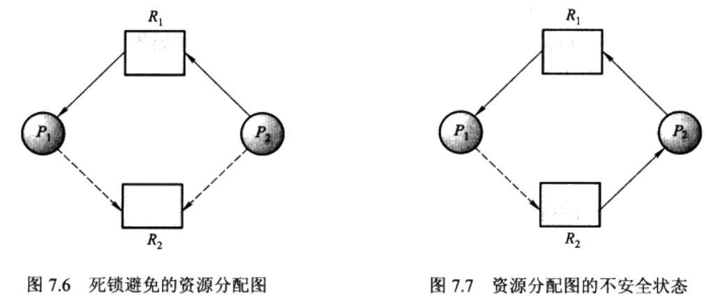

    当p2申请r2时,虽然r2空缺,但是不能分配给他,如果分配了就成环了.

    另外检测图中是否有环的算法需要n^2级操作,其中n是进程个数


3. 银行家算法

    - 当用户进程首次申请资源时,要确定该进程的资源最大需求量,如果系统现存的资源满足它最大需求量则按当前的申请量分配资源;
    - 进程在执行中申请资源时,先验证它所占用的资源和此次申请资源数有没有超过最大需求量(也就是有没有守诚信),然后再验证系统的现存资源数是否能满足该进程尚需的最大资源数.

    银行家算法的数据结构

    1. 可利用资源向量Available 　　

        是个含有m个元素的数组，其中的每一个元素代表一类可利用的资源数目。如果Available[j]=K，则表示系统中现有Rj类资源K个。 　　

    2. 最大需求矩阵Max 　　

        这是一个n×m的矩阵，它定义了系统中n个进程中的每一个进程对m类资源的最大需求。如果Max[i,j]=K，则表示进程i需要Rj类资源的最大数目为K。 　　

    3. 分配矩阵Allocation 　　

        这也是一个n×m的矩阵，它定义了系统中每一类资源当前已分配给每一进程的资源数。如果Allocation[i,j]=K，则表示进程i当前已分得Rj类资源的 数目为K。 　　

    4. 需求矩阵Need。 　　

        这也是一个n×m的矩阵，用以表示每一个进程尚需的各类资源数。如果Need[i,j]=K，则表示进程i还需要Rj类资源K个，方能完成其任务。 　　

        Need[i,j]=Max[i,j] - Allocation[i,j] 

    算法过程:

    1. 银行家算法

        设Request i是进程Pi的请求向量，如果Request i[j]=K，表示进程Pi需要K个Rj类型的资源。当Pi发出资源请求后，系统按下述步骤进行检查：
        1. 如果Request i[j]≤Need[i,j]，便转向步骤(2)；否则认为出错，因为它所需要的资源数已超过它所宣布的最大值。
        2. 如果Request i[j]≤Available[j]，便转向步骤(3)；否则，表示尚无足够资源，Pi须等待。
        3. 系统试探着把资源分配给进程P i，并修改下面数据结构中的数值：

            Available[j]:= Available[j]-Request i[j]；

            Allocation[i,j]:= Allocation[i,j]+Request i[j]；

            Need[i,j]:= Need[i,j]-Request i[j]；

        4. 系统执行安全性算法，检查此次资源分配后系统是否处于安全状态。若安全，才正式将资源分配给进程Pi，以完成本次分配；否则，将本次的试探分配作废，恢复原来的资源分配状态，让进程Pi等待。 

    2. 安全性检测算法


        1. 设置两个向量：

            1. 工作向量Work，它表示系统可提供给进程继续运行所需的各类资源数目，它含有m个元素，在执行安全算法开始时，Work:=Available。
            2. Finish，它表示系统是否有足够的资源分配给进程，使之运行完成。开始时先做Finish[i]:=false；当有足够资源分配给进程时，再令Finish[i]:=true。

        2. 从进程集合中找到一个能满足下述条件的进程：

            1. Finish[i]=false；
            2. Need[i,j]≤Work[j]；若找到，执行步骤(3)，否则，执行步骤(4)。

        3. 当进程Pi获得资源后，可顺利执行，直至完成，并释放出分配给它的资源，故应执行：

            Work[j]:= Work[j]+Allocation[i,j]；
            Finish[i]:=true；
            go to step （2）;

        4. 如果所有进程的Finish[i]=true都满足，则表示系统处于安全状态；否则，系统处于不安全状态。

    示例

    1. 假定系统中有五个进程{P0，P1，P2，P3，P4}和三类资源{A，B，C}，各种资源的数量分别为10、5、7，在T0时刻的资源分配情况如图示。 （先忽略P1第二行的括号）

        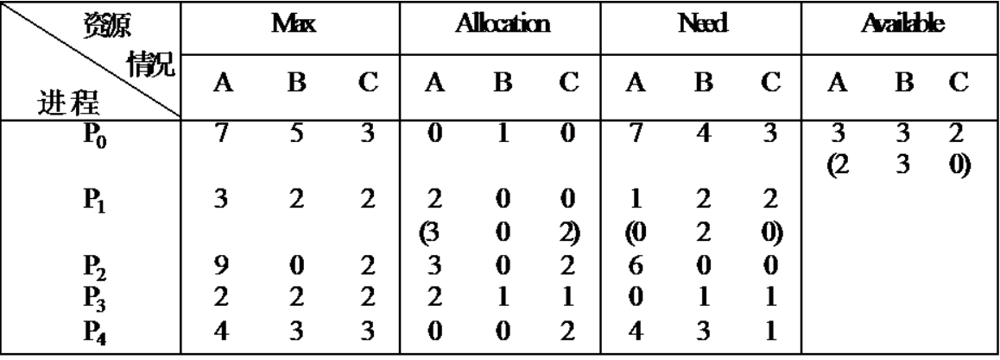

    2. T0时刻的安全性：利用安全性算法对T0时刻的资源分配情况进行分析如下图可知，在T0时刻存在着一个安全序列{P1，P3，P4，P2，P0}，故系统是安全的。

        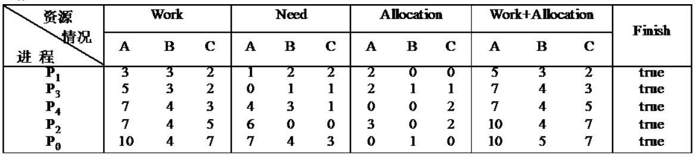

    3. P1请求资源：P1发出请求向量Request1(1，0，2)，系统按银行家算法进行检查：

        1. Request1(1，0，2)≤Need1(1，2，2)
        2. Request1(1，0，2)≤Available1(3，3，2)
        3. 系统先假定可为P1分配资源，并修改Available，Allocation1和Need1向量，形成的资源变化情况如下图圆括号所示

        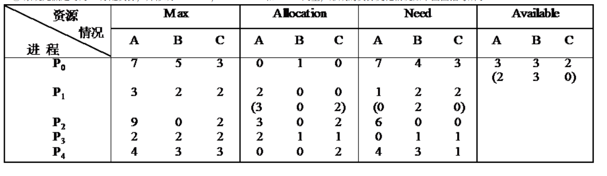

    4. 再利用安全性算法检查此时系统是否安全。如图所示。

        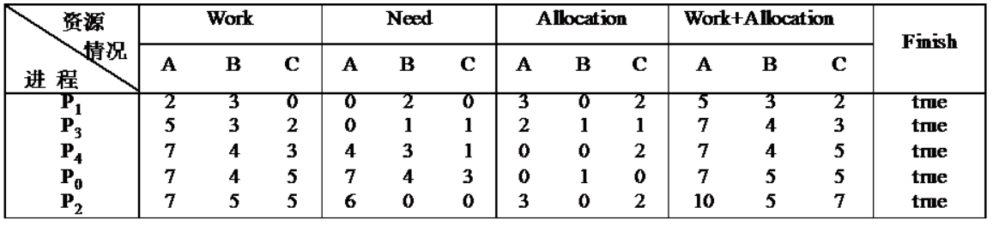

    5. P4请求资源：P4发出请求向量Request4(3，3，0)，系统按银行家算法进行检查：

        1. Request4(3，3，0)≤Need4(4，3，1)；
        2. Request4(3，3，0)≥Available(2，3，0)，让P4等待。（附：操作系统第三版这里写成了≤符号，需更正）

    6. P0请求资源：P0发出请求向量Requst0(0，2，0)，系统按银行家算法进行检查：

        1. Request0(0，2，0)≤Need0(7，4，3)；
        2. Request0(0，2，0)≤Available(2，3，0)；
        3. 系统暂时先假定可为P0分配资源，并修改有关数据，如图所示。

        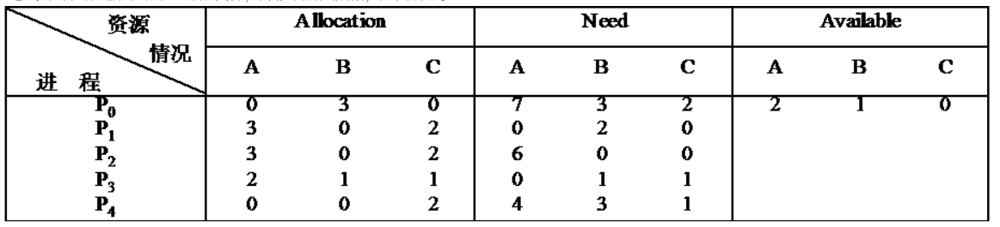


    7. 进行安全性检查：可用资源Available(2，1，0)已不能满足任何进程的需要，故系统进入不安全状态，此时系统不分配资源。

    > https://blog.csdn.net/cout_sev/article/details/24980627

#### 死锁的检测

1. 每种资源都只有单个实例

    创建等待图,如果等待图成环就代表发生了死锁

    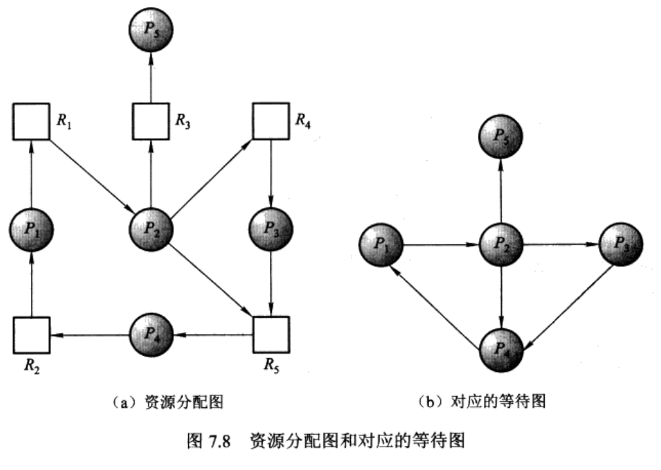

2. 多个实例的死锁检测

    数据结构

    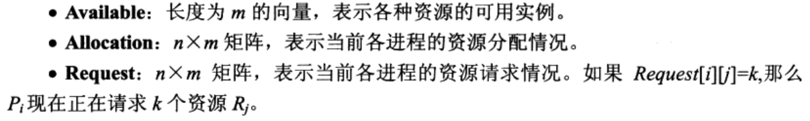

    示例

    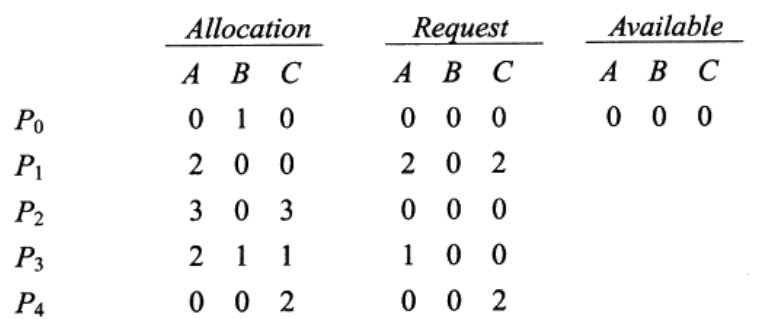

    此时系统不处于死锁状态,因为存在 p0,p2,p3,p1,p4

    假如p2 又请求了资源C的实例

    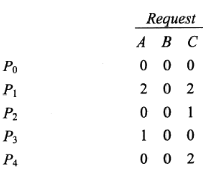

    此时就发生了死锁

3. 死锁解除
   
    一旦检测出死锁,应立即采取相应的措施,如:

   1. 资源剥夺法
   
        挂起某些死锁进程,并抢占其资源,给其他的死锁进程

   2. 撤销进程法

        强制撤销部分或者全部死锁进程并剥夺这些进程的资源.撤销的原则可以按优先级和撤销代价.

   3. 进程回退法

        让一个或多个进程回退到足以回避死锁的地步,进程回退时是资源释放资源而不是被剥夺.要求系统保持进程的历史信息,设置还原点.

## （五）存储器管理

### 分区存储管理、覆盖与交换；

### 页式管理及段式管理；

### 段、页式存储管理方法及实现技术；

### 虚存的原理及相关的各种算法和数据结构。

## （六）单处理器调度

### 处理器的三种调度类型；

1. 作业调度(高级调度)

    从外存的后备队列中选择一批作业进入内存，为他们建立进程。这些进程被送入就绪队列。频率最低.多道批处理系统才有.

2. 中级调度

    将暂时不能运行的进程调至外存等待,为了提高内存利用率和系统吞吐量

3. 进程调度(低级调度)

    按照某种方法和策略从就绪队列中选取一个进程执行.

### 调度算法的分类

1. 抢占和非抢占调度

    根据任务运行的过程中能否被中断的情况，把调度算法分为抢占和非抢占两种。在抢占式调度算法中，正在运行的任务可以被其他任务打断。在非抢占式调度算法中，一旦任务开始运行，该任务只有在运行完后而主动放弃CPU资源或者是因为等待其他资源而被阻塞的情况下才可能停止。

2. 静态和动态调度

    根据任务优先级确定的时机，把调度算法分为静态调度和动态调度两种。在静态调度算法中，所有任务的优先级在运行之前已经确定下来，这就要求能够完全把握系统中的所有任务及其时间约束（如截止时间，运行时间，优先顺序等）。在动态调度算法中，任务的优先级在在运行时确定，并且可能不断的发生变化。

> 原文：https://blog.csdn.net/Stephan14/article/details/46468241 

### 进程调度方式

1. 当一个进程从运行状态切换到等待状态(例如,IO请求,调用wait)
2. 当一个进程从运行状态切换到就绪状态(例如,出现中断)
3. 当一个进程从等待状态切换到就绪状态(例如,IO完成时)
4. 当一个进程终止时

当调度只发生在1和4两种情况时,称为非抢断.否则是抢断的.

### 调度准则

- CPU使用率
- 吞吐量: 单位事件内完成进程的数量
- 周转时间: 从某个特定的进程的角度看,从进程提交到进程完成的时间段.包括,等待进入内存,在就绪队列中等待,在cpu执行和IO执行
- 等待时间: 进程在就绪队列中等待所花费时间之和.
- 响应时间: 在交互系统中,从提交请求到产生第一响应的事件.就是开始响应所需要的时间

### 进程调度的各种算法及其特点。

- 先到先服务调度(FCFS:first-come,first-served)

    

- 最短作业优先调度(SJF:shortest-job-first)非抢占式

    

- 最短剩余事件优先调度(SRTN:shortest-remaining-time-first) 抢占式的SJF
  
    

- 优先级调度（Priority Scheduling）/一般用小数字表示高优先级
    
    缺陷: 叽饿;无穷阻塞,低优先级的无穷等待

    解决方法: 老化(aging),逐渐增加系统中等待事件长的进程的优先级

- 轮转法(Round Robin，RR)专门为分时系统设计

    1. 每个就绪进程获得一小段CPU时间（时间片，time quantum），通常10ms - 100ms
    2. 时间片用毕，这个进程被迫交出CPU，重新挂回到就绪队列,当然，进程在时间片用毕之前其Burst Cycle结束，也（主动）交出CPU

    假设n个就绪进程，时间片q，每个就绪进程得到1/n的CPU时间。任何就绪进程最多等待(n-1)*q单位时间.

    

    轮转法还有一个好处，就是他的响应时间一定优于前面的SJF。因为时间片的存在。

- 多级队列调度

    要求交互的进程，在前台队列。可以批处理的进程，在后台队列。

    每个队列都有其自己的调度算法，例如：

    1. 前台就绪队列 — RR
    2. 后台就绪队列 — FCFS

    按优先级分别为：
    1. 系统进程队列，要实时响应。
    2. 交互进程队列（要求响应非常及时）—— RR
    3. 交互编辑队列（人输入键盘，移动鼠标等，响应时间可能半秒也可以，对操作系统来说已经很长了。交互要求不是很高）—— RR
    4. 批处理进程队列，不需要交互。—— FCFS

    CPU怎么在队列间分配？

    1. 固定优先权法。例如，先前台队列，再后台队列。
    2. 时间片办法，例如，80%的CPU时间给前台队列，20%CPU时间给后台进程。

- 多层反馈队列调度

    

    图上三层队列：

    1. Q0 — 用RR算法，时间片8ms
    2. Q1 — 用RR算法，时间片16ms
    3. Q2 — 用FCFS算法。

    调度场景

    1. 一个就绪进程进入Q0层，当它分配到CPU，可执行8ms。如果它8ms后没有执行完毕，则迁移至Q1层。否则，它离开就绪队列该干嘛干嘛。
    2. 在Q1层，当它分配到CPU，可执行16ms。如果它16ms后没有执行完毕，则迁移至Q2层。否则，它离开就绪队列，该干嘛干嘛。

总结

忽略HRRN,Feedback


> https://www.jianshu.com/p/65360b500ad9

## （七）多处理器调度和实时调度

### 多处理器对进程调度的影响；

1. 处理器亲和性

   由于使缓存无效或重新构建的代价高,绝大多数SMP系统试图避免将进程从一个处理器移至另一个处理器,而是努力使-个进程在同一个处理器上运行,这被称为处理器亲和性.

    当一个操作系统具有设法让一个进程保持在同一个处理器上运行的策略,但不能做任何保证时,则会出现**软亲和性**,有可能在处理器之间移动。,还提供一个支持**硬亲和性**的系统调用,从而允许进程指定它不允许移至其他处理器上。

2. 负载均衡

### 多处理器环境下的进程和线程调度算法；

#### CPU调度

1. 全局队列调度 

    1. 操作系统维护一个全局的任务等待队列。
    2. 当系统中有一个CPU核心空闲时，操作系统就从全局任务等待队列中选取就绪任务开始在此核心上执行。

    - 这种方法的优点是CPU核心利用率较高。

2. 局部队列调度

    1. 操作系统为每个CPU内核维护一个局部的任务等待队列。
    2. 当系统中有一个CPU内核空闲时，便从该核心的任务等待队列中选取恰当的任务执行。
    - 这种方法的优点是任务基本上无需在多个CPU核心间切换，有利于提高CPU核心局部Cache命中率。
    - 目前多数多核CPU操作系统采用的是基于全局队列的任务调度算法。

### 实时进程的特点；

1. 这些进程往往执行非常重要的操作,要求立即响应并执行
2. 只能被更高优先级的实时进程抢占
3. 比普通进程的优先级都要高

### 限期调度和速率单调调度方法。

实时系统的可调度条件:

 (有m个周期事件，事件i以周期Pi发生，并需要Ci秒CPU时间来处理事件)


1. 速率单调调度（实时静态算法）Rate Monotonic Scheduling，RMS

以用于满足以下条件的进程：

- 每个周期性进程必须在其周期内完成。
- 没有进程依赖于任何其他进程。
- 每一个进程在一次突发中需要相同的CPU时间量。
- 任何非周期进程都没有最终时限。
- 进程抢占时刻发生而没有系统开销。（理想模型）

单调速率算法按照以下规则给进程设立优先级：比如A进程每30ms运行一次，则每秒运行33次，则获得优先级33；B进程每秒运行20次，则获得优先级20，所以优先级与速率成线性关系，这就是这个算法的名字的来历。RMS算法是最优的实时静态算法中。

如果 成立,则其可以正常工作

2. 最早最终时限调度（实时动态算法）Earliest Deadline First，EDF

    列表按最终时限排序，EDF算法运行列表中的第一个进程，也是具有最近最终时限的进程。当一个新的进程就绪时，系统进行检查以了解其最终时限是否发生在当前运行的进程结束之前。如果是这样，那么新的进程就抢占当前正在运行的进程。

对比


对于RMS来说,前70ms,A以30ms为周期,每秒运行33次故优先级为33,同理得优先级A>B>C(33>25>20),在90ms时,A4的优先级高于B,所以抢占.

对于EDF来说,最终期限就是下一周期的起始时刻.在90ms时A和B的最终期限一样,不进行抢占


由于RMS的优先级只于速率有关,而与进程运行时间无关,所以在40-50ms时选择了执行B导致C未在下个周期开始前执行,导致失败.

> https://www.cnblogs.com/Philip-Tell-Truth/p/6680529.html

## （八）设备管理和磁盘调度

### 操作系统中输入/输出功能的组织；

#### I/O控制方式

外围设备和内存之间的I/O控制方式:

1. 程序直接控制法

    无中断机制,cpu对外设状态进行循环检查

2. 中断驱动方式

    I/O控制器收到cpu的一个读命令之后cpu就做其他事情,一旦数据读入,I/O控制器给CPU发送中断信号,表示数据已准备好.然后等待CPU请求该数据.

    但由于每个字再存储器与I/O设备之间的传输必须经过cpu,导致了消耗过多的cpu时间

3. DMA方式 (直接内存访问)

    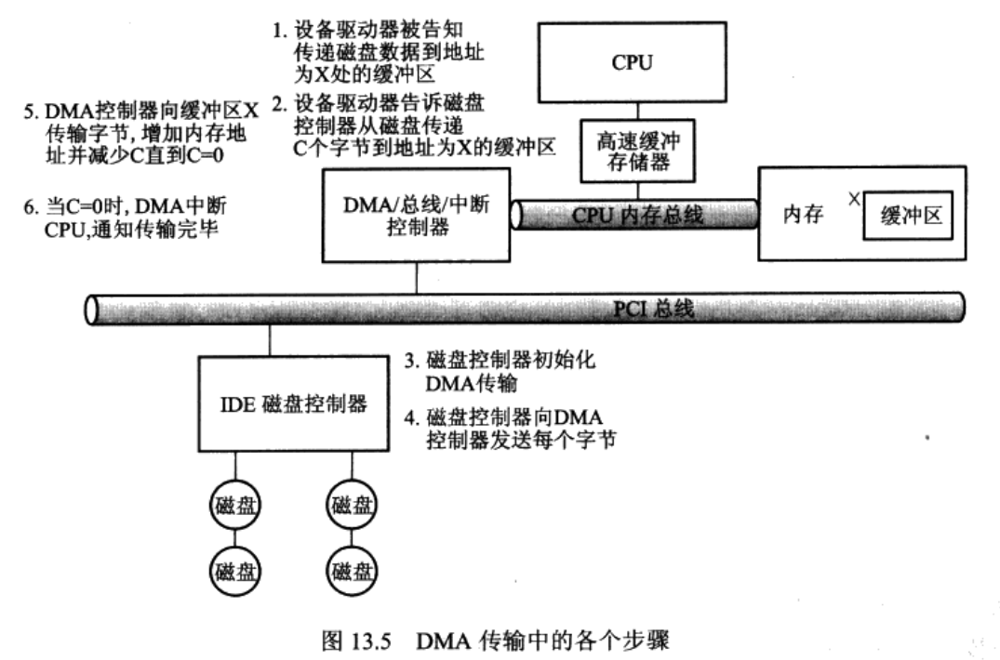

4. 通道控制方式

    I/O通道和DMA方式的区别是:DMA方式需要CPU来控制传输的数据块大小,传输的内存位置,而I/O通道方式中这些信息由通道控制.另外,每个DMA控制器对应一台设备与内存传递数据,而一个通道可以控制多台设备与内存的数据交换.


### 中断处理；

1. 应用进程请求读操作。

2. 设备启动程序（设备驱动程序的上半部分）查询设备控制器的状态寄存器，确定设备是否空闲；如果设备忙，则设备启动程序等待，直到它变为空闲为止。

3. 设备启动程序把输入命令存入设备控制器的命令寄存器中，从而启动设备。

4. 设备启动程序将相应信息写入到设备状态表的设备对应表项中，如最初调用的返回地址，以及I／O操作的一些特定参数等。然后CPU就可以分配给其他进程使用了，因此设备管理器调用进程管理器的调度程序执行，原进程的执行就被暂停了。

5. 经过一段时间设备完成了I／O操作后，设备控制器发出中断请求，中断CPU上运行的进程，从而引起CPU运行中断处理程序。

6. 中断处理程序确定是哪个设备引起的中断，然后转移到该设备对应的设备处理程序（设备驱动程序的下半部分）执行（唤醒设备驱动程序）。

7. 设备处理程序重新从设备状态表中，找到等待I／O操作的状态信息。

8. 设备处理程序拷贝设备控制器的数据寄存器的内容到用户进程的内存区。

9. 设备处理程序返回给应用进程控制权，从而继续运行。

### 设备驱动程序、设备无关的软件接口和spooling技术；

#### I/O子系统层次结构

1. 用户层I/O软件

    实现与用户交互的接口

2. 设备独立性软件

    实现用户程序与设备驱动器的统一接口,设备命令,设备保护,设备分配与释放

    **设备无关软件接口**

    这类设备无关性软件面向应用层并提供一个统一的应用编程接口(API)，它提供了一组功能函数，应用程序员能够通过调用它们管理设备。这个接口是设备硬件的一个大大简化了的简单抽象的接口，提供的是对具有逻辑性质的逻辑设备上的逻辑操作。由文件系统和设备管理功能接受、翻译、转换为相应的物理设备、物理性质、物理操作。与设备无关的系统软件实现的功能有：设备驱动程序的统一接口，设备命名，设备保护，提供一个与设备无关的逻辑块，缓冲，存储设备的块分配，独占设备的分配和释放，错误处理等。

3. **设备驱动程序**

    与硬件直接相关,负责具体实现系统对设备放出的操作指令.

    主要功能将来自上层软件的与设备无关的的抽象请求转为具体请求，向有关的输入输出设备的各种控制器的寄存器发出控制命令，并监督它们的正确执行，进行必要的错误处理。还要对各种可能的有关设备排队、挂起、唤醒等操作进行处理，执行确定的缓冲区策略等

4. 中断处理程序

    用于处理中断相关事项.

5. 硬件

    包括一个机械部件和一个电子部件(控制器)

#### spooling

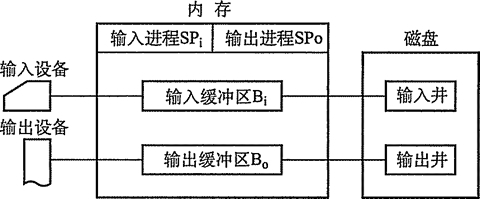

就是把磁盘当做缓冲区.

当用户进程请求打印输出时，SPOOLing系统同意为它打印输出，但并不真正 立即把打印机分配给该用户进程，而只为它做两件事：
由输出进程在输出井中为之申请一个空闲磁盘块区，并将要打印的数据送入其中。

- 输出进程再为用户进程申请一张空白的用户请求打印表
- 将用户的打印要求填入 其中，再将该表挂到请求打印队列上。

SPOOLing系统的主要特点有：提高了 I/O的速度；将独占设备改造为共享设备；实现 了虚拟设备功能。

### 缓冲策略；

1. 单缓冲

    在块设备输入时，假定从磁盘把一块数据输入到缓冲区的时间为T，操作系统将该缓冲区中的数据传送到用户区的时间为M，而CPU对这一块数据处理的时间为 C。由于T和C是可以并行的，当T>C时，系统对每一块数据的处理时间为M+T，反之则为M+C，故可把系统对每一块数据的处理时间表示为**Max(C, T)+M**.

    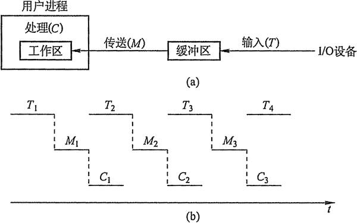

2. 双缓冲

    据单缓冲的特点，CPU在传送时间M内处于空闲状态，由此引入双缓冲。 I/O设备输入数据时先装填到缓冲区1，在缓冲区1填满后才开始装填缓冲区2，与此同时处理机可以从缓冲区1中取出数据放入用户进程处理，当缓冲区1中的数据处理完后，若缓冲区2已填满，则处理机又从缓冲区2中取出数据放入用户进程处理，而I/O设备又可以装填缓冲区1。双缓冲机制提高了处理机和输入设备的并行操作的程度。

    处理用时 MAX(C+M,T)

    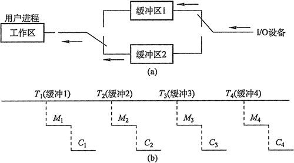

3. 循环缓冲


    包含多个大小相等的缓冲区，每个缓冲区中有一个链接指针指向下一个缓冲区，最后一个缓冲区指针指向第一个缓冲区，多个缓冲区构成一个环形。（类似于循环队列）

    循环缓冲用于输入/输出时，还需要有两个指针in和out。对输入而言，首先要从设备接收数据到缓冲区中，in指针指向可以输入数据的第一个空缓冲区；当运行进程需要数据时，从循环缓冲区中取一个装满数据的缓冲区，并从此缓冲区中提取数据，out指针指向可以提取数据的第一个满缓冲区。输出则正好相反。

4. 缓冲池


    由多个系统公用的缓冲区组成，缓冲区按其使用状况可以形成三个队列：

    - 空缓冲队列
    - 装满输入数据的缓冲队列（输入队列）
    - 装满输出数据的缓沖队列（输出队列）。

    还应具有四种缓冲区：

    - 用于收容输入数据的工作缓冲区
    - 用于提取输入数据的工作缓冲区
    - 用于收容输出数据的工作缓冲区
    - 用于提取输出数据的工作缓冲区。

    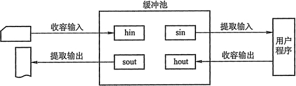

    当输入进程需要输入数据时，便从空缓冲队列的队首摘下一个空缓冲区，把它作为收容输入工作缓冲区，然后把输入数据输入其中，装满后再将它挂到输入队列队尾。

    当计算进程需要输入数据时，便从输入队列取得一个缓冲区作为提取输入工作缓冲区，计算进程从中提取数据，数据用完后再将它挂到空缓冲队列尾。

    当计算进程需要输出数据时，便从空缓冲队列的队首取得一个空缓冲区，作为收容输出工作缓冲区，当其中装满输出数据后，再将它挂到输出队列队尾。

    当要输出时，由输出进程从输出队列中取得一个装满输出数据的缓冲区，作为提取输出工作缓冲区，当数据提取完后，再将它挂到空缓冲队列的队尾。

### 磁盘调度算法；

假设当前磁头在67号，要求访问的磁道号顺序为98,25,63,97,56,51,55,55,6  (电脑随机产生的,设定最外层磁道号为100号)

1. FIFO：先来先服务算法；

    假设当前磁道在某一位置，依次处理服务队列里的每一个磁道，这样做的优点是处理起来比较简单，但缺点是磁头移动的距离和平均移动距离会很大。

    FIFO算法的服务序列是：98,25,63,97,56,51,55,55,6

    磁头移动的总距离distance = (98-67)+(98-25)+(63-25)+(97-63)+(97-56)+(56-51)+(55-51)+(55-55)+(55-6)

2. SSTF： 最短寻道时间算法；

    假设当前磁道在某一位置，接下来处理的是距离当前磁道最近的磁道号，处理完成之后再处理离这个磁道号最近的磁道号，直到所有的磁道号都服务完了程序结束.
    
    这样做的优点是性能会优于FIFO算法，但是会产生距离当前磁道较远的磁道号长期得不到服务，也就是“饥饿”现象，因为要求访问的服务的序列号是动态产生的，即各个应用程序可能不断地提出访问不同的磁道号的请求。

    SSTF算法的服务序列是: 63,56,55,55,51,25,6,97,98

    磁头移动的总距离distance = (67-63)+(63-56)+(56-55)+(55-55)+(55-51)+(51-25)+(25-6)+(97-6)+(98-97)

3. SCAN：电梯调度算法；(这样命名很形象)

    先按照一个方向(比如从外向内扫描)，扫描的过程中依次访问要求服务的序列。当扫描到最里层的一个服务序列时反向扫描，这里要注意，假设最里层为0号磁道，最里面的一个要求服务的序列是5号，访问完5号之后，就反向了，不需要再往里扫。结合电梯过程更好理解，在电梯往下接人的时候，明知道最下面一层是没有人的，它是不会再往下走的。(LOOK调度才是如此)

    SCAN算法的服务序列是：63,56,55,55,51,25,6,97,98

    磁头移动的总距离distance = (67-63)+(63-56)+(56-55)+(55-55)+(55-51)+(51-25)+(25-6)+(97-6)+(98-97)

4. CSCAN： 循环扫描算法 (C-LOOK)

    由于上边的算法在磁头折返回去的时候,会导致很长一段时间可能没有服务.因为最近已经访问过了.

    访问完最里面一个要求服务的序列之后，立即回到最外层欲访问磁道。也就是始终保持一个方向。故也称之为单向扫描调度算法。从最里面的一个磁道立即回到最外层欲访问的磁道，这步的距离是两者磁道号差的绝对值。

    CSCAN算法的服务序列是：63,56,55,55,51,25,6,98,97

    distance = (67-63)+(63-56)+(56-55)+(55-55)+(55-51)+(51-25)+(25-6)+|6-98|+(98-97

5. FSCAN：分步电梯调度算法(分两个队列)

    在扫描的过程中所有新产生的序列放在另外的一个队列中，当访问完当前队列之后，再访问新产生的一个队列。这种算法可以有效防止磁壁粘着现象。

> https://blog.csdn.net/Jaster_wisdom/article/details/52345674

### 磁盘阵列(Redundant Array of Independent Disks)

1. RAID 0

    没有冗余

2. RAID 1

    原理是把一个磁盘的数据镜像到另一个磁盘上，也就是说数据在写入一块磁盘的同时，会在另一块闲置的磁盘上生成镜像文件

3. RAID 2 差错纠正码

    每个字节都有相关的奇偶位,存在其他磁盘上,损坏一位的时候可以恢复.

4. RAID 3 交叉奇偶结构

    按扇区为单位来计算奇偶值.

5. RAID 4 块交织奇偶结构

    按磁盘来计算奇偶值,计算结果存在一个磁盘上

6. RAID 5

    按磁盘来计算奇偶值,结果保存在不同的磁盘上.

7. RAID 6

    类似 RAID 5 但是加入了差错纠正码等.

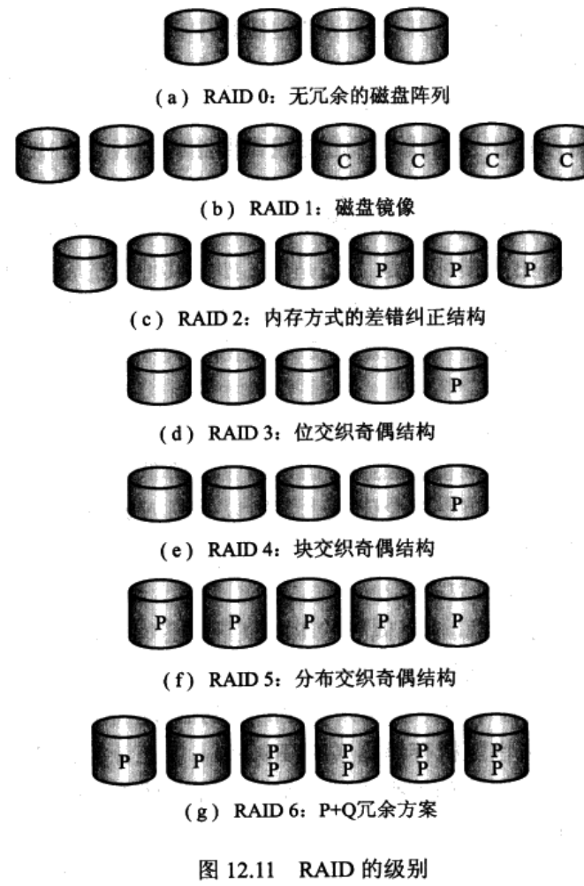

## （九）文件系统

### 文件系统特点与文件组织方式；

### 文件系统的数据结构；

### 目录的基本性质及其实现方法；

### 磁盘空间的管理。

## （十）分布式系统

### 分布式操作系统的类型

1. 网络操作系统 ssh
2. 分布式操作系统

### 分布式处理的特点、类型；

### 多层体系结构、中间件技术；

### 机群系统；

### 分布式进程管理相关的操作系统设计问题。