# Operating System

## （一）基本概念

### 计算机基本构成、处理器的内部结构、高速缓冲存储器CACHE；

#### 计算机的基本构成

存储器、控制器、运算器、输入设备、输出设备

#### 处理器的内部结构

CPU主要有运算器、控制器、寄存器组合内部总线等部件组成。

#### cache

当处理器发出内存访问请求时，会先查看缓存内是否有请求数据。如果存在（命中），则不经访问内存直接返回该数据；如果不存在（失效），则要先把内存中的相应数据载入缓存，再将其返回处理器。

### 操作系统的概念、演变历程、特性、分类、运行环境、功能；

#### 操作系统的概念

操作系统是一种系统软件

#### 演变历程

1. 手工操作阶段

    无操作系统

2. 批处理阶段

    1. 单道批处理系统
        
        内存中始终保持一道作业

    2. 多道批处理系统

        允许多个程序同时计入内存并运行,当某个程序因I/O请求而暂停运行时,CPU转去运行另一道程序

3. 分时操作系统

    时间片

4. 实时造作系统

    为了再某个时间限制内完成某些紧急任务而不需时间片排队, 主要特点是及时性和可靠性.

    1. 硬实时系统

        必须绝对地再规定的时刻发生, 如导弹发射系统

    2. 软实时系统

        允许偶尔违反时间规定, 如飞机订票系统.

#### 特征

1. 并发

    宏观上多个程序在运行,通过分时得以实现

2. 共享

    系统中的资源可供内存中多个并发执行的进程共同使用

3. 虚拟
4. 异步

    可能导致进程产生与时间有关的错误

#### 运行环境

#### 功能

1. 时钟管理

    计时,通过时钟中断实现进程切换.

2. 中断机制

    - 外中断: 如设备发出I/O结束中断;时钟中断
    - 内中断(异常): 如程序的非法操作码,地址越界...

3. 原语

    程序的运行需要原子性,如CPU切换,进程通信等功能中的部分操作.

4. 系统控制的数据结构及处理

    1. 进程管理
    2. 存储器管理
    3. 设备管理

### 存储器的层次结构。

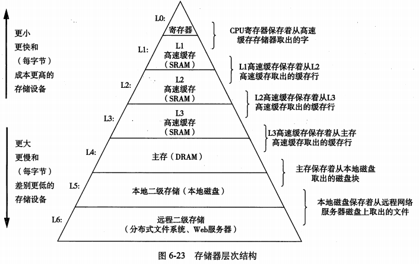

## （二）进程

### 进程的概念和特点；

#### 概念

为了是参与并发执行的程序能独立的运行，必须为之配置一个专门的数据结构，称之为进程控制块（process control block），系统利用PCB来描述进程的基本情况和运行状态，进而控制和管理进程。

组成:

1. PCB: 保存进程运行期间相关数据,是进程存在的唯一标识

    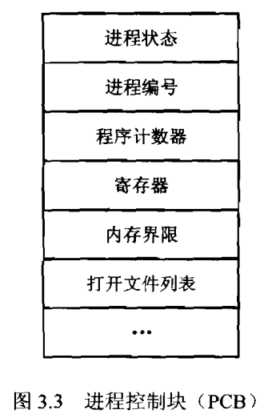

2. 程序段: 能被进程调度程序调度到CPU运行的程序的代码段
3. 数据段: 存储程序运行期间的相关数据 

#### 特点

1. 动态性：进程是程序的一次执行，他有着创建、活动、暂停、终止等过程，具有一定的生命周期，是动态的产生、变化和消亡的。动态性是进程最基本的特征。

2. 并发性：至多个进程实体，同存于内存中，能在一段时间内同时运行，并发性是进程的重要特征，同时也是操作系统的重要特征，引入进程的目的就是为了是程序能与去其他进程的程序并发执行，以提高资源利用率。

3. 独立性：指进程实体是一个能独立运行、独立获得资源和独立接收调度的基本单位。范围建立PCB的程序都不能作为一个独立的单位参与运行。

4. 异步性：由于进程的相互制约，是进程具有执行的间断性。也即进程按各自独立的、不可预知的速度向前推进。异步性会导致执行结果不可再现性，为此，在操作系统中必须配置相应的进程同步机制。 

5. 结构性：每个进程都配置一个PCB对其进行描述。从结构上来看，进程实体是由程序段、数据段和进程控制端三部分组成的。

### 进程状态转换

进程状态

1. 运行状态：进程正在处理器上运行。在单处理器的环境下，每一时刻最多只有一个进程处于运行状态。
2. 就绪状态：进程已处于准备运行的状态，即进程获得了除CPU之外的一切所需资源，一旦得到处理器即可运行。
3. 阻塞状态：又称为等待状态：进程正在等待某一事件而暂停运行，如等待某资源为可用（不包括处理器），或等待输入输出的完成。及时处理器空闲，该进程也不能运行。
4. 创建状态：进程正在被创建，尚未转到就绪状态。创建进程通常需要多个步骤：首先申请一个空白的PCB，并向PCB中填写一些控制和管理进程的信息；然后由系统为该进程分配运行时所必须的资源；最后把该进程转入到就绪状态。
5. 结束状态：进程正在从系统中消失，这可能是进程正常结束或其他原因中断退出运行。当进程需要结束运行时，系统首先必须置该进程为结束状态，然后再进一步处理资源释放和回收工作。

    注意区别就绪状态和等待状态：就绪状态是指进程仅缺少处理器，只要活得处理器资源就立即执行；而等待状态是指进程需要其他资源或等待某一事件，即使处理器空闲也不能运行。

状态转换

- 就绪状态=>运行状态: 劲歌处理器调度,就绪进程得到处理器资源
- 运行状态=>就绪状态: 时间片用完或有更高优先级的进程进入
- 运行状态=>阻塞状态: 进程所需要的某一资源还未准备好
- 阻塞状态=>就绪状态: 进程需要的资源已经准备好

## （三）线程、对称多处理SMP和微内核

### 线程的概念，定义线程的必要性和可能性；

#### 概念

程序执行流的最小单元,由线程ID,程序计数器,寄存器集合和堆栈组成.

#### 必要性

进程的切换开销很大,而线程的开销较小.而且线程间通讯效率更高.使系统拥有更好的并发性,提高了系统的吞吐性.

#### 可能性

当然可能,废话

### 线程的功能特性与实现方式；

#### 功能特性

线程状态

1. 阻塞: 当线程需要等待一个事件,它将被阻塞(保存它的用户寄存器,程序计数器,栈指针),此时处理器执行同一进程中或不同进程的就绪线程

    注:程序计数器是用于存放下一条指令所在单元的地址的地方。

2. 解除阻塞
3. 结束

#### 实现方式

用户级线程&内核级线程

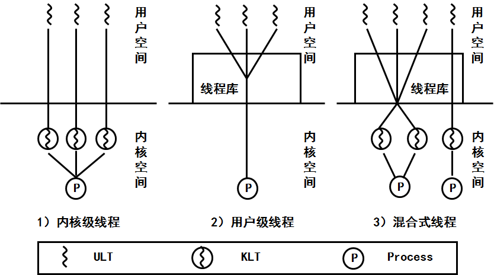

用户级线程(多对一)

- 优点: 效率比较高
- 缺点: 当一个线程在使用内核服务时被阻塞了,那么整个进程都会被阻塞
  
内核级线程(一对一)

- 优点: 当一个线程在被阻塞时,完全不慌
- 缺点: 效率低

多对多模型: 将n个用户级线程映射到m个内核级线程上,要求m小于等于n

- 缺点&优点: 集大成者

### 线程vs进程

1. 调度

    线程时**独立调度**的基本单位,进程时**拥有资源**的基本单位

2. 拥有资源

    进程拥有系统资源,线程也有一点必不可少的资源.

3. 并发性

    拥有线程的操作系统并发性更好.

4. 系统开销

    进程的创建,切换,撤销的效率低于线程

5. 地址空间和其他资源

    进程之间的地址空间相互独立

6. 通信资源

    进程间的通信(IPC)需要进行进程同步和互斥手段的辅助

### 对称多处理SMP体系结构；

#### SMP (Symmetric multiprocessing)

SMP是一种紧耦合、共享存储的系统模型，特点是多个CPU使用共同的系统总线，因此可访问共同的外设和存储器资源。（所有处理器通过一条高速总线或者一个转换器在同一机器中紧密耦合。处理器共享同样的全局内存、磁盘和 I/0 设备。只有一份操作系统的副本跨所有处理器运行，并且操作系统必须设计为能利用这种体系结构（多线程操作系统））

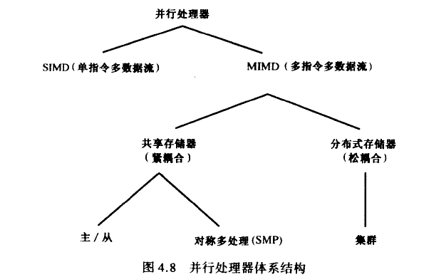

#### 对称多处理系统

即每个处理器自我调度.在对称多处理系统上，在操作系统的支持下，无论进程是处于用户空间，或是核心空间，都可以分配到任何一个处理器上运行。因此，进程可以在不同的处理器间移动，达到负载平衡，使系统的效率提升。

#### 非对称处理系统

让一个处理器(主服务器)处理所有的调度,决定,I/O处理以及其他系统活动,其他的处理器只执行用户代码。这种非对称处理系统

#### SMP体系结构

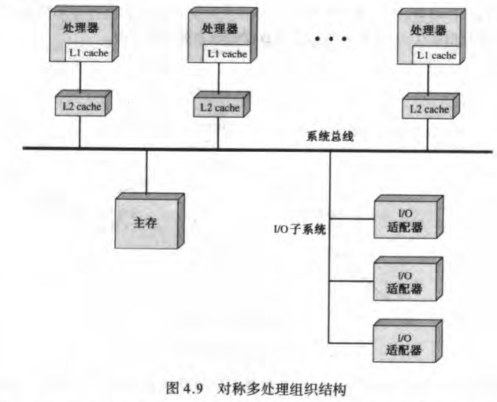

1. 并发进程或线程：为了允许多个处理器同时执行相同的内核代码，内核例程必须是可重入的。多处理器执行内核的相同部分和不同部分时，必须正确的管理内核表和管理结构，以避免死锁或非法操作；

2. 调度：调度可以由任何处理器执行，因此必须避免冲突。如果使用内核级多线程，则可能出现同一时刻，多个处理器同时从同一个进程中调度多个线程的情况；

3. 同步：因此存在多个进程都可能访问共享地址空间和共享I/O资源的情况，因此需要提供同步机制。同步是指实施互斥和事件排序的机制。锁是一个通用的同步机制；

4. 存储器管理：多处理器系统为了提高性能，尽可能利用硬件的并行性，如多端口存储器，还必须协调不同处理器上的分页机制，以确保多个处理器共享页或段时页面的一致性问题，以及页替换策略；

5. 可靠性和容错：当一个处理器处理失败时，操作系统应该提供功能衰减能力，重新组织管理表；

### 操作系统的体系结构（微内核与单内核）及其性能分析。

#### 单内核

单内核就是把os从整体上作为一个单独的大过程来实现，同时也运行在一个单独的地址空间上。性能好,Unix系统就是单内核.Linux也是单内核,但它加入了很多高级的东西

#### 微内核

微内核的功能被划分为多个独立的过程，每个过程叫做一个服务器。各个服务器通信需要IPC机制,模块化安全且省地方.windows等

## （四）并发

### 并发性问题及相关概念，如临界区、互斥、信号量和管程等；

#### 临界区

每个**进程**有一个代码段称为临界区,在该区的进程可能会改变共同的变量等.重要的特征:当一个进程进入到临界区,其他进程不可以进来.

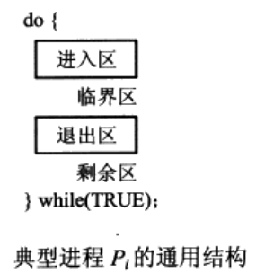

1. 抢占内核

   允许处于内核模式的进程被抢占

2. 非抢占内核
    
   允许处于内核模式的进程被抢占

#### 互斥

是指某一资源同时只允许一个访问者对其进行访问，具有唯一性和排它性。但互斥无法限制访问者对资源的访问顺序，即访问是无序的。

#### 同步

是指在互斥的基础上（大多数情况），通过其它机制实现访问者对资源的有序访问。在大多数情况下，同步已经实现了互斥，特别是所有写入资源的情况必定是互斥的。少数情况是指可以允许多个访问者同时访问资源。

#### 信号量

信号量S是整数变量,除了初始化,它的值表示**还可以有几个线程进入临界区**,只能通过两个原子操作访问:

wait(S)=>P操作

```c
wait(S){
    while(S<=0)
        ;
    S--;
}
```

signal(S)=>V操作

```c
signal(S){
    S++;
}
```

二进制的信号量又称为**同步锁**

上述的信号量的缺点时**忙等待**,这类型的信号量称为自旋锁(spinlock)

在多处理器的情况下,必须禁止每个处理器的中断.

为了克服忙等待,当一个进程调用wait操作时,发现信号量小于0时,则将自己放入等待队列并阻塞自己,当调用signal时,通过wakeup操作,将等待队列中的某进程从等待状态=>就绪状态,等系统调度执行. 定义如下:

```c
typedef struct{
    int value;
    struct process *list; //PCB链表
}semaphore;

wait(semaphore *S){
    S->value--;
    if (S->value<0){
        // add this process to list
        block();
    }
}

signal(S){
    S->value++;
    if (S->value <=0 ){
        remove a process P from list
        wakeup(P);
    }
}
```

#### 管程 = 互斥锁 + 条件变量

管程可以看做一个软件模块，它是将共享的变量和对于这些共享变量的操作封装起来，形成一个具有一定接口的功能模块，进程可以调用管程来实现进程级别的并发控制。

管程只允许一个进程执行管程中的代码,但是进入管程的线程可以因为条件未满足,放弃继续执行,并被放入条件队列中,等时机成熟再执行

哲学家吃饭例子:哲学家围成一个圈,当哲学家饿了,并且两边的人没有正在吃饭,则可拿起两根筷子吃饭

```c
monitor dp
{
   enum {thinking, hungry, eating} state[5];
   condition self[5];

   void pickup(int i) {
      state[i] = hungry;
      test(i);
      if (state[i] != eating)
         self[i].wait();//P操作
   }

   void putdown(int i) {
      state[i] = thinking;
      test( (i+4)%5 ); // important
      test( (i+1)%5 ); // important
   }

   void test(int i) {
      if ((state[(i+4)%5] != eating) &&
          (state[i] == hungry) &&
          (state[(i+1)%5] != eating)) {
         state[i] = eating;
         self[i].signal();//V操作
      }
   }

   void init() {
      for (int i = 0; i < 5; i++)
         state[i] = thinking;
   }
}
```

### 进程互斥、同步和通信的各种算法；

### 死锁的概念、死锁的原因和条件；

### 死锁的预防、避免和检测算法。

## （五）存储器管理

### 分区存储管理、覆盖与交换；

### 页式管理及段式管理；

### 段、页式存储管理方法及实现技术；

### 虚存的原理及相关的各种算法和数据结构。

## （六）单处理器调度

### 处理器的三种调度类型；

1. 作业调度(高级调度)

    从外存的后备队列中选择一批作业进入内存，为他们建立进程。这些进程被送入就绪队列。频率最低.多道批处理系统才有.

2. 中级调度

    将暂时不能运行的进程调至外存等待,为了提高内存利用率和系统吞吐量

3. 进程调度(低级调度)

    按照某种方法和策略从就绪队列中选取一个进程执行.

### 调度算法的分类

1. 抢占和非抢占调度

    根据任务运行的过程中能否被中断的情况，把调度算法分为抢占和非抢占两种。在抢占式调度算法中，正在运行的任务可以被其他任务打断。在非抢占式调度算法中，一旦任务开始运行，该任务只有在运行完后而主动放弃CPU资源或者是因为等待其他资源而被阻塞的情况下才可能停止。

2. 静态和动态调度

    根据任务优先级确定的时机，把调度算法分为静态调度和动态调度两种。在静态调度算法中，所有任务的优先级在运行之前已经确定下来，这就要求能够完全把握系统中的所有任务及其时间约束（如截止时间，运行时间，优先顺序等）。在动态调度算法中，任务的优先级在在运行时确定，并且可能不断的发生变化。

> 原文：https://blog.csdn.net/Stephan14/article/details/46468241 

### 进程调度方式

1. 当一个进程从运行状态切换到等待状态(例如,IO请求,调用wait)
2. 当一个进程从运行状态切换到就绪状态(例如,出现中断)
3. 当一个进程从等待状态切换到就绪状态(例如,IO完成时)
4. 当一个进程终止时

当调度只发生在1和4两种情况时,称为非抢断.否则是抢断的.

### 调度准则

- CPU使用率
- 吞吐量: 单位事件内完成进程的数量
- 周转时间: 从某个特定的进程的角度看,从进程提交到进程完成的时间段.包括,等待进入内存,在就绪队列中等待,在cpu执行和IO执行
- 等待时间: 进程在就绪队列中等待所花费时间之和.
- 响应时间: 在交互系统中,从提交请求到产生第一响应的事件.就是开始响应所需要的时间

### 进程调度的各种算法及其特点。

- 先到先服务调度(FCFS:first-come,first-served)

    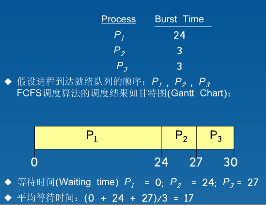

- 最短作业优先调度(SJF:shortest-job-first)非抢占式

    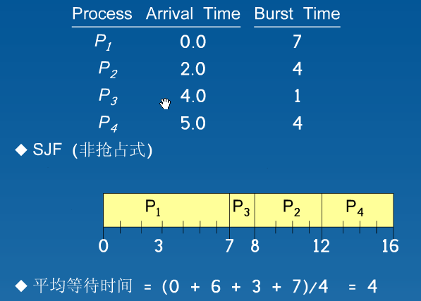

- 最短剩余事件优先调度(SRTN:shortest-remaining-time-first) 抢占式的SJF
  
    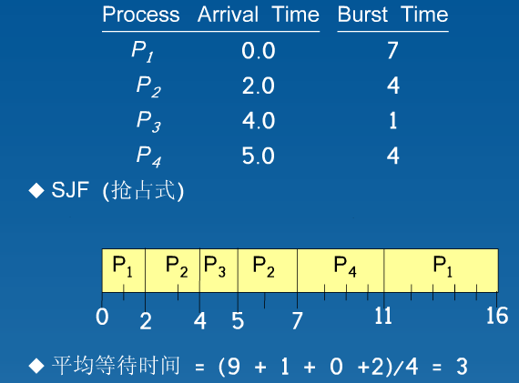

- 优先级调度（Priority Scheduling）/一般用小数字表示高优先级
    
    缺陷: 叽饿;无穷阻塞,低优先级的无穷等待

    解决方法: 老化(aging),逐渐增加系统中等待事件长的进程的优先级

- 轮转法(Round Robin，RR)专门为分时系统设计

    1. 每个就绪进程获得一小段CPU时间（时间片，time quantum），通常10ms - 100ms
    2. 时间片用毕，这个进程被迫交出CPU，重新挂回到就绪队列,当然，进程在时间片用毕之前其Burst Cycle结束，也（主动）交出CPU

    假设n个就绪进程，时间片q，每个就绪进程得到1/n的CPU时间。任何就绪进程最多等待(n-1)*q单位时间.

    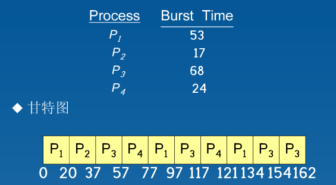

    轮转法还有一个好处，就是他的响应时间一定优于前面的SJF。因为时间片的存在。

- 多级队列调度

    要求交互的进程，在前台队列。可以批处理的进程，在后台队列。

    每个队列都有其自己的调度算法，例如：

    1. 前台就绪队列 — RR
    2. 后台就绪队列 — FCFS

    按优先级分别为：
    1. 系统进程队列，要实时响应。
    2. 交互进程队列（要求响应非常及时）—— RR
    3. 交互编辑队列（人输入键盘，移动鼠标等，响应时间可能半秒也可以，对操作系统来说已经很长了。交互要求不是很高）—— RR
    4. 批处理进程队列，不需要交互。—— FCFS

    CPU怎么在队列间分配？

    1. 固定优先权法。例如，先前台队列，再后台队列。
    2. 时间片办法，例如，80%的CPU时间给前台队列，20%CPU时间给后台进程。

- 多层反馈队列调度

    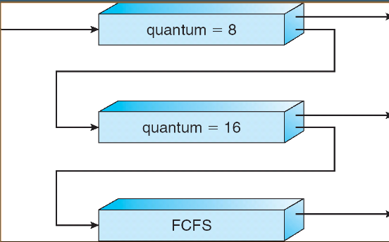

    图上三层队列：

    1. Q0 — 用RR算法，时间片8ms
    2. Q1 — 用RR算法，时间片16ms
    3. Q2 — 用FCFS算法。

    调度场景

    1. 一个就绪进程进入Q0层，当它分配到CPU，可执行8ms。如果它8ms后没有执行完毕，则迁移至Q1层。否则，它离开就绪队列该干嘛干嘛。
    2. 在Q1层，当它分配到CPU，可执行16ms。如果它16ms后没有执行完毕，则迁移至Q2层。否则，它离开就绪队列，该干嘛干嘛。

总结

忽略HRRN,Feedback

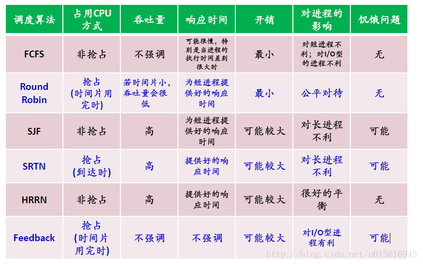

> https://www.jianshu.com/p/65360b500ad9

## （七）多处理器调度和实时调度

### 多处理器对进程调度的影响；

1. 处理器亲和性

   由于使缓存无效或重新构建的代价高,绝大多数SMP系统试图避免将进程从一个处理器移至另一个处理器,而是努力使-个进程在同一个处理器上运行,这被称为处理器亲和性.

    当一个操作系统具有设法让一个进程保持在同一个处理器上运行的策略,但不能做任何保证时,则会出现**软亲和性**,有可能在处理器之间移动。,还提供一个支持**硬亲和性**的系统调用,从而允许进程指定它不允许移至其他处理器上。

2. 负载均衡

### 多处理器环境下的进程和线程调度算法；

#### CPU调度

1. 全局队列调度 

    1. 操作系统维护一个全局的任务等待队列。
    2. 当系统中有一个CPU核心空闲时，操作系统就从全局任务等待队列中选取就绪任务开始在此核心上执行。

    - 这种方法的优点是CPU核心利用率较高。

2. 局部队列调度

    1. 操作系统为每个CPU内核维护一个局部的任务等待队列。
    2. 当系统中有一个CPU内核空闲时，便从该核心的任务等待队列中选取恰当的任务执行。
    - 这种方法的优点是任务基本上无需在多个CPU核心间切换，有利于提高CPU核心局部Cache命中率。
    - 目前多数多核CPU操作系统采用的是基于全局队列的任务调度算法。

### 实时进程的特点；

1. 这些进程往往执行非常重要的操作,要求立即响应并执行
2. 只能被更高优先级的实时进程抢占
3. 比普通进程的优先级都要高

### 限期调度和速率单调调度方法。

实时系统的可调度条件:

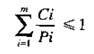 (有m个周期事件，事件i以周期Pi发生，并需要Ci秒CPU时间来处理事件)


1. 速率单调调度（实时静态算法）Rate Monotonic Scheduling，RMS

以用于满足以下条件的进程：

- 每个周期性进程必须在其周期内完成。
- 没有进程依赖于任何其他进程。
- 每一个进程在一次突发中需要相同的CPU时间量。
- 任何非周期进程都没有最终时限。
- 进程抢占时刻发生而没有系统开销。（理想模型）

单调速率算法按照以下规则给进程设立优先级：比如A进程每30ms运行一次，则每秒运行33次，则获得优先级33；B进程每秒运行20次，则获得优先级20，所以优先级与速率成线性关系，这就是这个算法的名字的来历。RMS算法是最优的实时静态算法中。

如果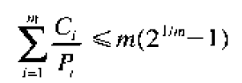 成立,则其可以正常工作

2. 最早最终时限调度（实时动态算法）Earliest Deadline First，EDF

    列表按最终时限排序，EDF算法运行列表中的第一个进程，也是具有最近最终时限的进程。当一个新的进程就绪时，系统进行检查以了解其最终时限是否发生在当前运行的进程结束之前。如果是这样，那么新的进程就抢占当前正在运行的进程。

对比

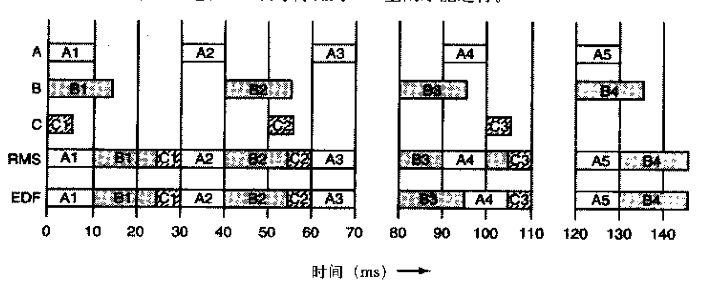

对于RMS来说,前70ms,A以30ms为周期,每秒运行33次故优先级为33,同理得优先级A>B>C(33>25>20),在90ms时,A4的优先级高于B,所以抢占.

对于EDF来说,最终期限就是下一周期的起始时刻.在90ms时A和B的最终期限一样,不进行抢占

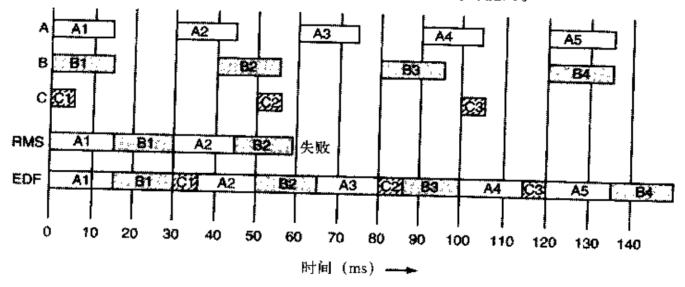

由于RMS的优先级只于速率有关,而与进程运行时间无关,所以在40-50ms时选择了执行B导致C未在下个周期开始前执行,导致失败.

> https://www.cnblogs.com/Philip-Tell-Truth/p/6680529.html

## （八）设备管理和磁盘调度

### 操作系统中输入/输出功能的组织；

### 中断处理；

### 设备驱动程序、设备无关的软件接口和spooling技术；

### 缓冲策略；

### 磁盘调度算法；

### 磁盘阵列。

## （九）文件系统

### 文件系统特点与文件组织方式；

### 文件系统的数据结构；

### 目录的基本性质及其实现方法；

### 磁盘空间的管理。

## （十）分布式系统

### 分布式操作系统的类型

1. 网络操作系统 ssh
2. 分布式操作系统

### 分布式处理的特点、类型；

### 多层体系结构、中间件技术；

### 机群系统；

### 分布式进程管理相关的操作系统设计问题。